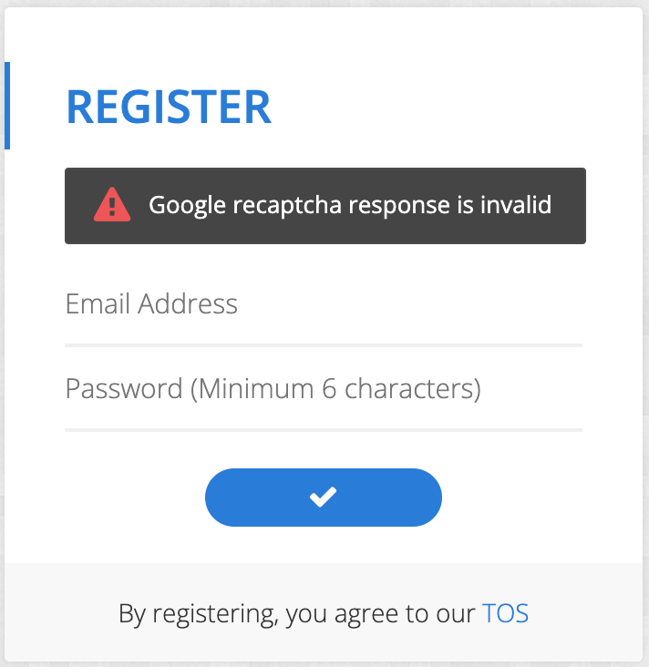
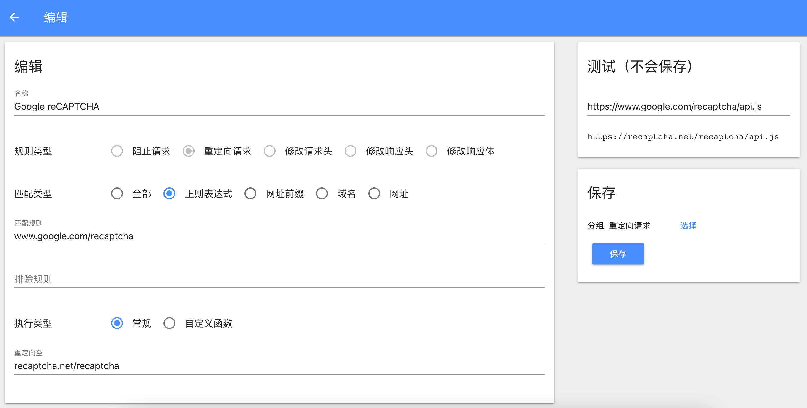
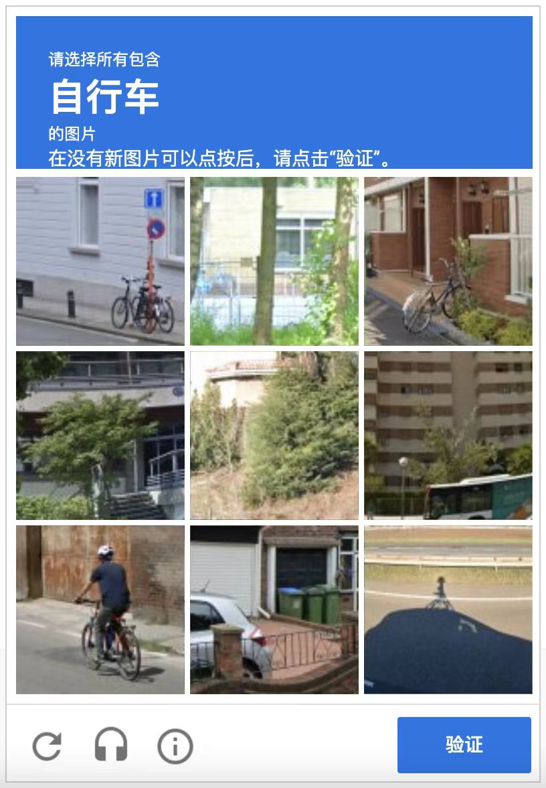

+++
slug = "2023052701"
date = "2023-05-27"
lastmod = "2023-05-30"
title = "Google reCAPTCHA无效的解放方案"
description = "国内访问国外网站时，如果网站采用了Google的reCAPTCHA人机验证服务，经常发生如“ReCaptcha is not valid”、“Google recaptcha response is invalid”、“ReCaptcha error”等问题，导致我们的访问受阻……"
#image = "images/01.jpg"
tags = [ "博客空间", "Google reCAPTCHA" ]
categories = [ "专业技术" ]
+++

## 问题分析
&emsp;&emsp;当我们访问国外网站，特别是在提交注册、登录表单时，经常出现“ReCaptcha is not valid”、“Google recaptcha response is invalid”、“ReCaptcha error”等错误提示文案，导致表单提交失败，如下图所示：

&emsp;&emsp;其原因是该网站采用了Google的人机验证ReCaptcha服务（简单类似于国内的验证码），该服务需要加载的主要JS脚本为：**https://www.google.com/recaptcha/api.js** ，因国内网络屏蔽了Google服务，导致无法加载本JS脚本

## 解决方案
&emsp;&emsp;Google网络和服务不可用，但是有可用的服务网站，那就是：**https://recaptcha.net/recaptcha/api.js** 。我们可以通过浏览器插件，把访问Google的api.js重定向到recaptcha.net的服务。

### 安装浏览器插件
插件有很多，我用的是：Header Editor，还有gooreplacer等插件，都可以使用。请自行在浏览器市场搜索该插件，并完成安装和启用。

### 配置Header Editor插件（其他插件类似）
配置内容说明： 
- 名称：随便取一个名称即可（如：Google reCAPTCHA等）
- 规则类型：选择**重定向请求** 选项，代表请求Google的服务重定向到可用网络服务
- 匹配类型：选择**正则表达式** 选项，通过通配符等匹配，我们本次只有1个网站，所以也不需要通配符
- 匹配规则：输入**www.google.com/recaptcha** ，代表需要替换这部分内容
- 执行类型：选择**常规** 选项
- 重定向至：输入**recaptcha.net/recaptcha** ，代表替换Google的网站内容

---

&emsp;&emsp;配置完成之后，还可以测试一下：
- 输入：**https://www.google.com/recaptcha/api.js**
- 输出：**https://recaptcha.net/recaptcha/api.js**
替换成功了。

重新提交表单，就能看到人机校验的弹框了：

