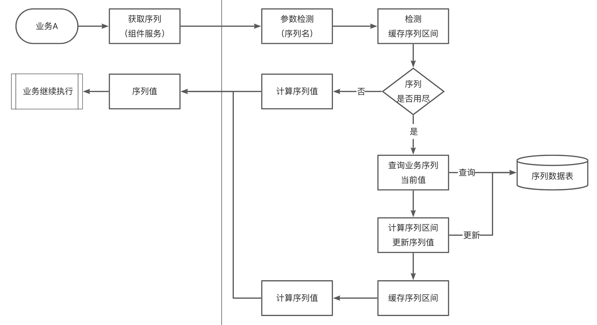

+++
slug = "2023062101"
date = "2023-06-21"
lastmod = "2023-06-21"
title = "开源通用高性能的分布式id序列组件"
description = "业务数据的存储，少不了数据记录的id序列，id序列（或称序列）的生成方式有很多种，比如当前时间戳、数据库的序列值（Oracle的序列，MySQL的自增ID等）、UUID等方式，但这些生成方式均存在一定的局限性，本文介绍一种通用高性能的分布式id序列的设计思路……"
image = "01.jpg"
tags = [ "Java", "id序列", "高性能" ]
categories = [ "专业技术", "开源组件" ]
+++

- Gitee源代码仓库：[https://gitee.com/obullxl/sequence-jdbc](https://gitee.com/obullxl/sequence-jdbc)
- GitHub源代码仓库：[https://github.com/obullxl/sequence-jdbc](https://github.com/obullxl/sequence-jdbc)

---

## 分布式id序列说明
业务数据的存储，少不了数据记录的id序列。

id序列（或称序列）的生成方式有很多种，比如当前时间戳、数据库的序列值（Oracle的序列，MySQL的自增ID等）、UUID等方式。

这些生成方式都有一定的局限性，如时间戳在业务量较大时容易重复、Oracle序列和MySQL的自增ID限定了数据库类型（且MySQL的自增ID只能保证单库唯一，在分库分表的场景下也不适用）、UUID容易重复且无法保证递增等。

同时，一般业务数据的id序列通常会带上一些业务信息，比如增加业务标识前缀、增加年月日等信息。业务id序列的处理变得多样，则进一步要求业务id序列的生成通用且高效。

## 通用分布式id序列组件
为了屏蔽业务获取id序列因数据库类型、分库分表等带来的研发和维护成本，我们把分布式id序列的获取抽取为一个通用组件，对业务统一接口和规范。

通用分布式id序列实现方式有很多，本文主要介绍一种基于数据表的实现方式，通过一张表记录所有的业务序列名和值，业务根据序列名获取下一个序列值（和Oracle序列类型，但是无需为每个序列创建序列，因此更简单）：



本方案的设计主要考量点：
- `通用性：`仅依赖一张序列数据表，JDBC支持的数据库均可使用，包括SQLite、MySQL、Oracle、OceanBase等。
- `高性能：`本地缓存一个序列区间，缓存使用完之前无DB交互；缓存的区间可设置，区间越大，DB访问越少，性能越高。
- `分布式：`受益于集中式的序列数据表，保证了序列全局唯一。

## 分布式id序列组件设计
### 组件接口设计
组件接口只有1个，就是获取序列：

```java
/**
 * Author: obullxl@163.com
 * Copyright (c) 2020-2023 All Rights Reserved.
 */
package cn.ntopic.sequence;

/**
 * 分布式序列服务
 *
 * @author obullxl 2023年06月21日: 新增
 */
public interface NTSequence {

    /**
     * 默认序列名称
     */
    String DEFAULT_SEQUENCE_NAME = "DEFAULT";

    /**
     * 序列名称最大长度
     */
    int MAX_SEQUENCE_NAME_LENGTH = 64;

    /**
     * 获取下一个序列值
     *
     * @return 获取默认序列的新的唯一的序列值 {@link #DEFAULT_SEQUENCE_NAME}
     * @throws IllegalArgumentException 参数非法
     */
    default long next() {
        return this.next(DEFAULT_SEQUENCE_NAME);
    }


    /**
     * 获取下一个序列值
     *
     * @param sequenceName 序列名称，非空，1~64字符，业务可随意指定（如：用户模块为`USER`，订单模块为`ORDER`等）
     * @return 新的唯一的序列值
     * @throws IllegalArgumentException 参数非法
     */
    long next(String sequenceName);
}
```

### 组件可控参数
在追求通用性和性能的同时，以参数的方式供个性化调控：
- `id序列数据表名：`默认值为nt_sequence；但对于不同的业务，对数据表名有要求规范（如：表名前置等），因此序列数据表名可设置
- `id序列起始值：`默认值为1，即序列值从1开始递增；但对于存量业务，id值起始值需要比存量最大值要大，否则容易重复
- `id序列最大值：`默认值为99999999，序列值递增到最大值，则循环从起始值开始
- `序列更新重试次数：`默认值为10，当缓存序列用尽，需要查询和更新序列数据表，比较存在网络通讯和DB操作，不可避免存在异常失败，失败后会进行重试
- `序列缓存大小：`默认值为1000，值越大，访问DB越少，性能越高，序列的连续性越差（如：缓存大小为1000，当序列用到400时，服务器重启了，那么401~1000直接的序列就丢失了）；相反，值越小，访问DB越多，性能越低，序列的连续性越好。

```java
/**
 * 属性-数据源
 */
private final DataSource ntDataSource;

/**
 * 属性-重试次数
 */
private int retryTimes = 10;

/**
 * 属性-数据表名
 */
private String tableName = "nt_sequence";

/**
 * 属性-序列获取步长（即序列缓存大小）
 */
private long step = 1000L;

/**
 * 属性-序列最小值
 */
private long minValue = 1L;

/**
 * 属性-序列最大值
 */
private long maxValue = 99999999L;
```

### 序列组件使用
- Gitee源代码仓库：[https://gitee.com/obullxl/sequence-jdbc](https://gitee.com/obullxl/sequence-jdbc)
- GitHub源代码仓库：[https://github.com/obullxl/sequence-jdbc](https://github.com/obullxl/sequence-jdbc)

目前JAR包已经发布，通过Gitee进行仓库托管，也可直接使用，2步即可：
- 第一步：在项目源代码的根`pom.xml`中，设置仓库地址：

```xml
<repositories>
   <repository>
      <id>Gitee-obullxl</id>
      <url>https://gitee.com/obullxl/maven-repository/master/repository</url>
   </repository>
</repositories>
```

- 第二步：引用JAR包，仅需要依赖本JAR包，无其他JAR包依赖：
```xml
<dependency>
    <groupId>cn.ntopic</groupId>
    <artifactId>sequence-jdbc</artifactId>
    <version>1.0.1</version>
</dependency>
```

在业务代码中调用序列组件样例：
```java
// 1. 构建数据源
DruidDataSource dataSource = new DruidDataSource();
dataSource.setUrl("jdbc:sqlite:/Users/obullxl/CodeSpace/sequence-jdbc/SequenceJDBC.sqlite");
dataSource.setDriverClassName("org.sqlite.JDBC");
dataSource.setPoolPreparedStatements(false);
dataSource.setMaxPoolPreparedStatementPerConnectionSize(-1);
dataSource.setTestOnBorrow(true);
dataSource.setTestOnReturn(false);
dataSource.setTestWhileIdle(true);
dataSource.setValidationQuery("SELECT '1' FROM sqlite_master LIMIT 1");

// 2. 初始化序列组件
NTSequenceImpl ntSequence = new NTSequenceImpl(dataSource);
ntSequence.setTableName(tableName);
ntSequence.createTable();
ntSequence.init();

// 3. 获取序列值

@Autowire
@Qualifier("ntSequence")
private NTSequence ntSequence;

// 获取`DEFAULT`默认序列ID
long newId1 = ntSequence.next();
long newId2 = ntSequence.next();
long newId3 = ntSequence.next();

// 获取`USER`用户ID：
long newUserId1 = ntSequence.next("USER");
long newUserId2 = ntSequence.next("USER");
long newUserId3 = ntSequence.next("USER");

// 获取`ORDER`订单ID：
long newOrderId1 = ntSequence.next("ORDER");
long newOrderId2 = ntSequence.next("ORDER");
long newOrderId3 = ntSequence.next("ORDER");
```

完整的使用方法，可参数源代码仓库说明文档（`README.md`）：
- Gitee源代码仓库：[https://gitee.com/obullxl/sequence-jdbc](https://gitee.com/obullxl/sequence-jdbc)
- GitHub源代码仓库：[https://github.com/obullxl/sequence-jdbc](https://github.com/obullxl/sequence-jdbc)

## 分布式id序列测试用例
因为代码较大，请直接查看源代码：
- Gitee测试源代码：[https://gitee.com/obullxl/sequence-jdbc/blob/main/src/test/java/cn/ntopic/sequence/NTSequenceTest.java](https://gitee.com/obullxl/sequence-jdbc/blob/main/src/test/java/cn/ntopic/sequence/NTSequenceTest.java)
- GitHub测试源代码：[https://github.com/obullxl/sequence-jdbc/blob/main/src/test/java/cn/ntopic/sequence/NTSequenceTest.java](https://github.com/obullxl/sequence-jdbc/blob/main/src/test/java/cn/ntopic/sequence/NTSequenceTest.java)
