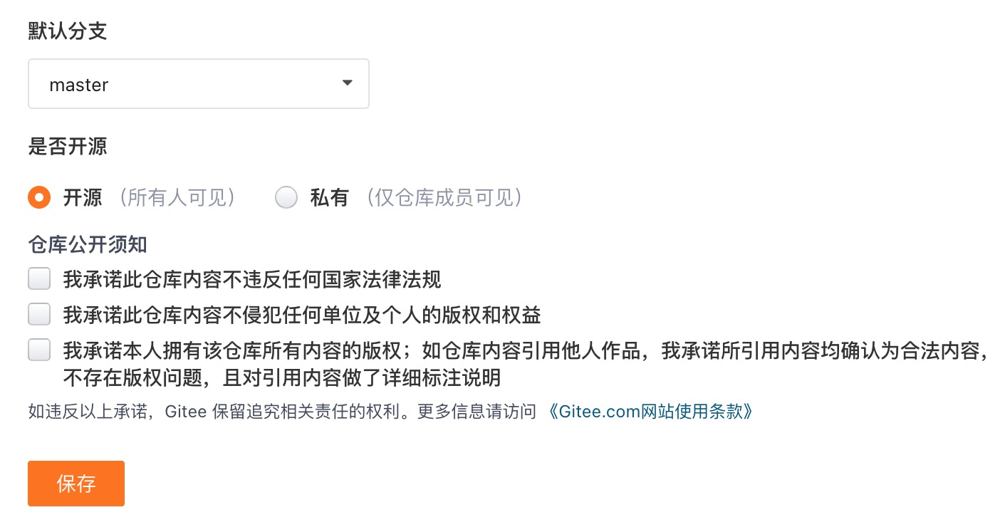
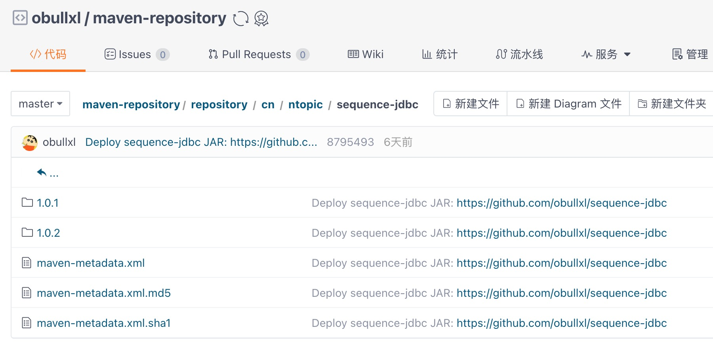

+++
slug = "2023062201"
date = "2023-06-22"
lastmod = "2023-06-30"
title = "使用Gitee或GitHub托管Maven仓库JAR包的便捷方法"
description = "我们开源了组件的源代码，希望更多人能更便捷的使用开源组件，最好的办法当然是把组件的JAR包上传到Maven中央仓库，这样可直接通过Maven/Gradle等方式快速引用和使用。但是要把JAR包上传到Maven中央仓库的门槛比较高，本文介绍一种非常简单的使用GitHub/Gitee作为Maven仓库的办法……"
image = "01.png"
tags = [ "Maven", "Gitee仓库", "GitHub仓库" ]
categories = [ "专业技术", "开源组件" ]
+++

我开源的JAR包的Gitee和GitHub托管的Maven仓库：

- Gitee托管仓库：[https://gitee.com/obullxl/maven-repository](https://gitee.com/obullxl/maven-repository)
- GitHub托管仓库：[https://github.com/obullxl/maven-repository](https://github.com/obullxl/maven-repository)

---

## 背景说明
在上一篇博客中，我们介绍了**开源通用高性能分布式id序列组件**（[https://ntopic.cn/p/2023062101/](https://ntopic.cn/p/2023062101/)）的设计思路，并把源代码托管在了Gitee（[https://gitee.com/obullxl/sequence-jdbc](https://gitee.com/obullxl/sequence-jdbc)）和GitHub（[https://github.com/obullxl/sequence-jdbc](https://github.com/obullxl/sequence-jdbc)）。

我们希望能让更多人便捷的使用本组件，那么把JAR包放到到Maven官方的中心仓库（[https://mvnrepository.com](https://mvnrepository.com)）当然是最好的选择。

然而要把JAR包上传到Maven官方中心仓库，步骤比较繁琐，包括注册、申请、发布配置等一系列操作。其实我们的本意只是想把自己的开源项目打包让大家方便使用，能否有更快捷的方式呢？当然是有的，我们可以使用Gitee或者GitHub作为Maven托管仓库，把我们的组件JAR包存储到托管仓库中。

## Gitee/GitHub仓库设置
由于Gitee和GitHub原理完全一致，下面截图说明以Gitee为主（GitHub是我们的主仓库，Gitee只是同步GitHub仓库，但这不妨碍我们的配置）。

建议在Gitee中单独申请一个仓库，专门用于存放JAR包，比如我的仓库叫**maven-repository**：[https://gitee.com/obullxl/maven-repository](https://gitee.com/obullxl/maven-repository)

同时，便于后续多个组件的JAR包能共用一个托管仓库，JAR包统一放到仓库的`repository`目录中：


`特别注意：`仓库请请设置为**开源**，否则其他人使用Maven托管仓库可能无法访问，从而无法下载组件JAR包：



## 打包发布JAR包到仓库
Gitee托管仓库设置好之后，开始设置我们打包并发布JAR包了。为便于后面设置打包命令，我们把托管Maven仓库的目录`maven-repository`和id序列组件仓库的目录`sequence-jdbc`放在同一个父目录中：

```shell
OXL-MacBook:CodeSpace obullxl$ ll
drwxr-xr-x   7 obullxl  staff    224  6 24 10:30 maven-repository
drwxr-xr-x  13 obullxl  staff    416  6 24 17:42 sequence-jdbc
```

### 组件pom.xml打包配置
完整的配置可直接参考分布式id序列的设置：[https://gitee.com/obullxl/sequence-jdbc/blob/master/pom.xml](https://gitee.com/obullxl/sequence-jdbc/blob/master/pom.xml)

- pom.xml文件，一定需要定义`groupId`/`artifactId`/`version`这Maven依赖坐标三要素：

```xml
<groupId>cn.ntopic</groupId>
<artifactId>sequence-jdbc</artifactId>
<version>1.0.2</version>
<packaging>jar</packaging>
```

- pom.xml文件，配置build节点，指定JAR打包、Deploy发布的配置（发布到Maven仓库的目录：`../maven-repository/repository`），即以下配置的**altDeploymentRepository**内容：

```xml
<build>
    <plugins>
        <plugin>
            <groupId>org.apache.maven.plugins</groupId>
            <artifactId>maven-compiler-plugin</artifactId>
            <version>2.3.2</version>
            <configuration>
                <source>1.8</source>
                <target>1.8</target>
                <encoding>UTF-8</encoding>
            </configuration>
        </plugin>
        <plugin>
            <groupId>org.apache.maven.plugins</groupId>
            <artifactId>maven-jar-plugin</artifactId>
            <version>2.5</version>
        </plugin>
        <plugin>
            <groupId>org.apache.maven.plugins</groupId>
            <artifactId>maven-source-plugin</artifactId>
            <version>2.1.2</version>
            <executions>
                <execution>
                    <phase>package</phase>
                    <goals>
                        <goal>jar</goal>
                    </goals>
                </execution>
            </executions>
        </plugin>
        <plugin>
            <groupId>org.codehaus.mojo</groupId>
            <artifactId>build-helper-maven-plugin</artifactId>
            <version>1.9.1</version>
            <executions>
                <execution>
                    <id>timestamp-property</id>
                    <goals>
                        <goal>timestamp-property</goal>
                    </goals>
                </execution>
            </executions>
            <configuration>
                <name>BuildTime</name>
                <pattern>yyyy-MM-dd HH:mm:ss.SSS</pattern>
                <timeZone>GMT+8</timeZone>
                <regex/>
                <source/>
                <value/>
            </configuration>
        </plugin>
        <plugin>
            <groupId>org.apache.maven.plugins</groupId>
            <artifactId>maven-antrun-plugin</artifactId>
            <version>1.3</version>
            <executions>
                <execution>
                    <id>generate-release</id>
                    <phase>compile</phase>
                    <goals>
                        <goal>run</goal>
                    </goals>
                    <configuration>
                        <tasks>
                            <!--suppress UnresolvedMavenProperty -->
                            <echo file="${project.basedir}/target/classes/NTopic.Release" message="Version=${project.version}${line.separator}BuildTime=${BuildTime}" />
                        </tasks>
                    </configuration>
                </execution>
            </executions>
        </plugin>
        <plugin>
            <groupId>org.apache.maven.plugins</groupId>
            <artifactId>maven-deploy-plugin</artifactId>
            <version>2.7</version>
            <configuration>
                <!-- 特别注意的地方：指定打包的目录 -->
                <altDeploymentRepository>internal.repo::default::file://${project.basedir}/../maven-repository/repository</altDeploymentRepository>
            </configuration>
        </plugin>
    </plugins>
</build>
```

### 打包并上传到仓库
- 打包并发布到本地目录命令：

```shell
mvn clean
mvn deploy -Dmaven.test.skip=true
```

- 上传到远程仓库命令：

```shell
cd ./../maven-repository
git add --all
git commit -m 'Deploy sequence-jdbc JAR: https://github.com/obullxl/sequence-jdbc'
git push origin master
```

完整的打包命令，请参考分布式id序列源仓库代码：[https://gitee.com/obullxl/sequence-jdbc/blob/master/deploy.sh](https://gitee.com/obullxl/sequence-jdbc/blob/master/deploy.sh)：

```shell
#!/bin/bash

# 本地打包
mvn clean && mvn deploy -Dmaven.test.skip=true

# 上传仓库
cd ./../maven-repository
git add --all
git commit -m 'Deploy sequence-jdbc JAR: https://github.com/obullxl/sequence-jdbc'
git push origin master

# 返回项目
cd ../sequence-jdbc

# Gitee刷新：人工刷新仓库，从GitHub同步过来
open -a '/Applications/Microsoft Edge.app' https://gitee.com/obullxl/maven-repository
```

**多个版本**完整的Maven托管仓库内容：




## 其他项目使用JAR包方法
和Maven官方的中心仓库相比，Gitee托管仓库没有本质区别，只需要在pom.xml中配置Gitee的托管仓库即可，让Maven知道从哪儿去下载JAR包。

### pom.xml中增加仓库
`pom.xml`中增加Gitee托管仓库地址：

```xml
<repositories>
  <repository>
    <id>Gitee-obullxl</id>
    <url>https://gitee.com/obullxl/maven-repository/raw/master/repository</url>
  </repository>
</repositories>
```

或者增加GitHub托管仓库地址：

```xml
<repositories>
   <repository>
      <id>GitHub-obullxl</id>
      <url>https://raw.githubusercontent.com/obullxl/maven-repository/master/repository</url>
   </repository>
</repositories>
```

### Maven配置依赖
和其他JAR包一样，`pom.xml`中增加依赖坐标：

```xml
<dependency>
    <groupId>cn.ntopic</groupId>
    <artifactId>sequence-jdbc</artifactId>
    <version>1.0.2</version>
</dependency>
```
