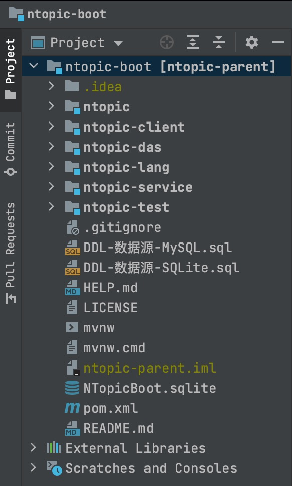
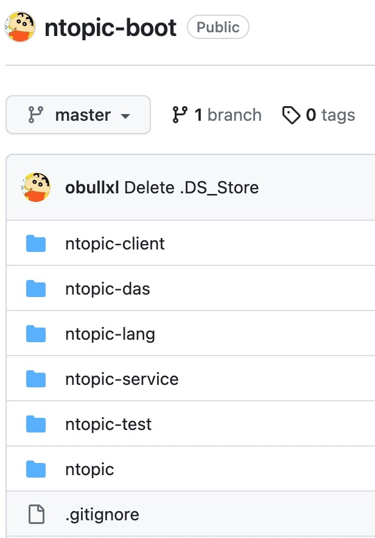
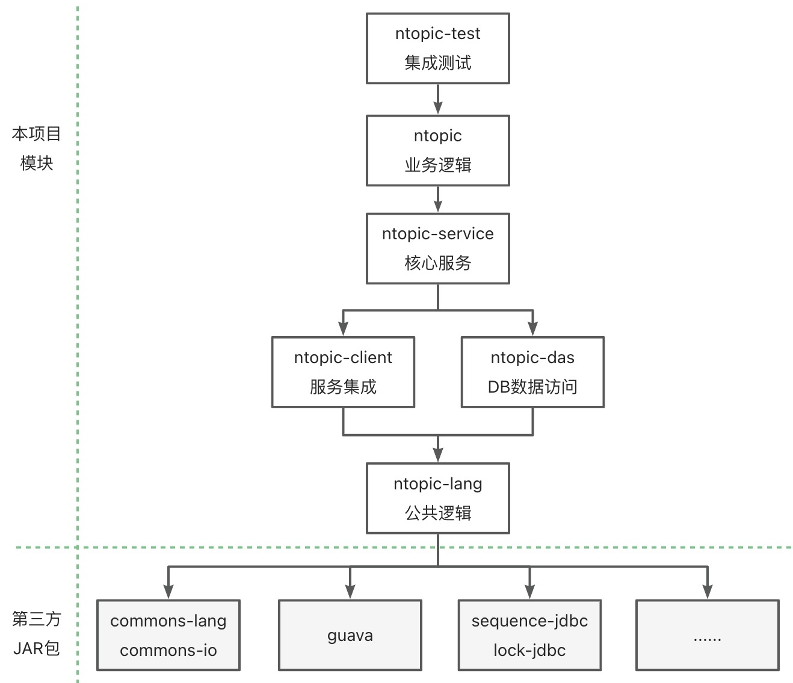

+++
slug = "2023071501"
date = "2023-07-15"
lastmod = "2023-07-15"
title = "Maven多模块项目架构配置介绍和实战"
description = "中大型项目中，我们都会把项目结构划分多个模块。它清晰的定义，便于项目结果维护，同时在日常代码变更时，各个模块的隔离也一定程度上保证了变更质量……"
image = "01.jpg"
#image = "https://picsum.photos/id/56/2000/400.jpg"
tags = [ "SpringBoot", "Maven", "模块" ]
categories = [ "专业技术" ]
+++

源代码先行：
- Gitee多模块项目仓库：[https://gitee.com/obullxl/ntopic-boot](https://gitee.com/obullxl/ntopic-boot)
- GitHub多模块项目仓库：[https://github.com/obullxl/ntopic-boot](https://github.com/obullxl/ntopic-boot)

## 背景介绍
我们项目采用的是Maven多模块架构，我发现项目的部分子模块的pom.xml中重复引用了相同的JAR包。很明显，当初在配置Maven模块的时候，没有考虑清楚各个模块的架构职责，同时也不了解Maven模块依赖的**传递性**。本文主要介绍一下Maven多模块的配置思路和多模块的配置实操。

## Maven多模块配置
在实操之前，我们先要了解配置概览，配置大致可分为**三大步**：确定项目需要哪几个模块，项目中的每个模块的依赖关系如何，最后根据依赖关系配置。

### 第一步：确定项目的模块划分
模块的划分没有任何强制要求，一般的划分思路如下：
- **test** 集成测试模块：该模块除了测试用例代码外，没有实际业务逻辑。项目中我们用junit和Mockito测试框架比较多，Mockito集成测试框架和SpringBoot集成可我之前的博客：[https://ntopic.cn/p/2023052001/](https://ntopic.cn/p/2023052001/)
- **facade** 对外服务接口模块（如果有的话，一般业务类项目较小，服务类较大）：主要是对外提供服务接口、请求参数和返回结果等JAR包，其他项目需要依赖项目JAR包，因此需要单独一个模块
- **client** 集成外部服务接口模块：和facade对应，如果依赖了外部服务的话
- **lang** 基础公用模块：各个模块都会依赖的公共类模块，比如常用工具类、通用枚举等
- **das** 数据访问模块：接入DB层的代码，包括DO/DAO等
- **service** 领域核心服务模块：各个业务领域的核心服务逻辑
- **web/biz** 业务模块：业务逻辑模块。如果业务比较复杂，可进一步拆分，如web-user/web-order等

根据上面说明，[https://gitee.com/obullxl/ntopic-boot](ntopic-boot)的模块划分如下：
- **ntopic-test** 集成测试模块
- **ntopic** 业务逻辑模块，包括SpringBoot启动类、Web模块、业务模块等
- **ntopic-servcie** 领域核心服务
- **ntopic-client** 外部服务器集成
- **ntopic-das** DB操作
- **ntopic-lang** 公共模块

| IDEA代码结构     | GitHub代码样例       |
| --------------- | ------------------ |
|      |         |

### 第二步：确定各个模块的依赖关系
Maven模块的依赖具备传递性，即：若模块A依赖了模块B，模块B依赖了模块C，则模块A自动依赖了模块C（有点类似于数学中数值大小的传递性，A>B且B>C，则A>C）。
[https://gitee.com/obullxl/ntopic-boot](ntopic-boot)项目的各个模块依赖关系说明：
- **ntopic-test** 集成测试模块：因为集成测试包括了所有的代码逻辑，所以它处于最上层
- **ntopic** 业务模块，业务逻辑依赖service模块提供核心服务
- **ntopic-service** 核心服务模块，它依赖DB数据读写和引入外部服务
- **ntopic-lang** 公共逻辑模块，它进一步依赖其他统一模块，如commons模块等



### 第三步：Maven多模块实操
多模块的核心在pom.xml文件中，任何一个pom.xml模块，都需要指定**五个**核心配置元素：
- **groupId** 代表大分组，一般都是公司的域名，如 cn.ntopic / com.aliaba 等
- **artifactId** 代表具体的JAR包名，如 sequence-jdbc / fastjson 等
- **version** 代表JAR包版本，如 1.0.1 / 1.2.76 等
- **packaging** 代表模块打包方式，默认都是jar，对于多模块的总模块或者父模块为pom
- name 代表模块名称，可选配置，建议配置

#### 总pom.xml文件
总pom.xml配置了整个项目的所有信息，包括项目的模块列表、依赖的JAR包、仓库和打包方式等。
- 指定父模块：可选的，可以没有父模块。如ntopic-boot是基于SpringBoot框架，所以它的父模块是SpringBoot的。
```xml
<?xml version="1.0" encoding="UTF-8"?>
<project xmlns="http://maven.apache.org/POM/4.0.0" xmlns:xsi="http://www.w3.org/2001/XMLSchema-instance"
         xsi:schemaLocation="http://maven.apache.org/POM/4.0.0 https://maven.apache.org/xsd/maven-4.0.0.xsd">
    <modelVersion>4.0.0</modelVersion>
    <parent>
        <groupId>org.springframework.boot</groupId>
        <artifactId>spring-boot-starter-parent</artifactId>
        <version>2.5.3</version>
        <relativePath/>
    </parent>

    <groupId>ntopic</groupId>
    <artifactId>ntopic-parent</artifactId>
    <version>1.0.1</version>
    <packaging>pom</packaging>

    <name>ntopic-parent</name>
```

- 指定模块本项目的模块列表：
```xml
    <modules>
        <module>ntopic-test</module>
        <module>ntopic</module>
        <module>ntopic-service</module>
        <module>ntopic-das</module>
        <module>ntopic-client</module>
        <module>ntopic-lang</module>
    </modules>
```

- 模块依赖管理，各个子模块中，可以直接使用这里配置的依赖：
```xml
    <dependencyManagement>
      <dependencies>
              <!-- NTopic Modules -->
              <dependency>
                  <groupId>ntopic</groupId>
                  <artifactId>ntopic-lang</artifactId>
                  <version>${ntopic.version}</version>
              </dependency>
              <dependency>
                  <groupId>ntopic</groupId>
                  <artifactId>ntopic-client</artifactId>
                  <version>${ntopic.version}</version>
              </dependency>
        <!-- 其他本项目子模块忽略 -->

        <!-- SpringBoot Starter -->
        <dependency>
            <groupId>org.springframework.boot</groupId>
            <artifactId>spring-boot-starter-jdbc</artifactId>
            <version>${springboot.boot.version}</version>
        </dependency>

        <!--  Google Guava -->
        <dependency>
            <groupId>com.google.guava</groupId>
            <artifactId>guava</artifactId>
            <version>30.1.1-jre</version>
        </dependency>

        <!-- 其他省略 -->
        </dependencies>
    </dependencyManagement>
```

- 额外的Maven仓库和打包方式配置：
```xml
    <repositories>
        <repository>
            <id>Gitee-obullxl</id>
            <url>https://gitee.com/obullxl/maven-repository/raw/sequence-jdbc</url>
        </repository>
    </repositories>

    <build>
        <plugins>
            <plugin>
                <groupId>org.springframework.boot</groupId>
                <artifactId>spring-boot-maven-plugin</artifactId>
                <version>${springboot.boot.version}</version>
            </plugin>
        </plugins>
    </build>
```

#### 子模块pom.xml文件
总模块配置好了之后，子模块的配置就简单多了，只需要配置3个信息块：父模块、四元素和依赖其它子模块。其中依赖的子模块按照第二步中的依赖关系配置即可：
```xml
<?xml version="1.0" encoding="UTF-8"?>
<project xmlns="http://maven.apache.org/POM/4.0.0" xmlns:xsi="http://www.w3.org/2001/XMLSchema-instance"
         xsi:schemaLocation="http://maven.apache.org/POM/4.0.0 https://maven.apache.org/xsd/maven-4.0.0.xsd">
    <modelVersion>4.0.0</modelVersion>
    <parent>
        <groupId>ntopic</groupId>
        <artifactId>ntopic-parent</artifactId>
        <version>1.0.1</version>
    </parent>

    <artifactId>ntopic-service</artifactId>
    <packaging>jar</packaging>
    <version>${ntopic.version}</version>

    <name>ntopic-service</name>

    <dependencies>
        <!-- NTopic Module -->
        <dependency>
            <groupId>ntopic</groupId>
            <artifactId>ntopic-das</artifactId>
        </dependency>
        <dependency>
            <groupId>ntopic</groupId>
            <artifactId>ntopic-client</artifactId>
        </dependency>
    </dependencies>
</project>
```

#### 编译项目各个模块
经过上面的配置，项目Maven多模块架构已经配置完成，进行项目编译即可：
```shell
mvn compile
```

编译成功的结果：
```text
[INFO] ------------------------------------------------------------------------
[INFO] Reactor Summary:
[INFO] 
[INFO] ntopic-parent ...................................... SUCCESS [  0.022 s]
[INFO] ntopic-lang ........................................ SUCCESS [  0.873 s]
[INFO] ntopic-das ......................................... SUCCESS [  0.121 s]
[INFO] ntopic-client ...................................... SUCCESS [  0.042 s]
[INFO] ntopic-service ..................................... SUCCESS [  0.055 s]
[INFO] ntopic ............................................. SUCCESS [  0.073 s]
[INFO] ntopic-test ........................................ SUCCESS [  0.114 s]
[INFO] ------------------------------------------------------------------------
[INFO] BUILD SUCCESS
[INFO] ------------------------------------------------------------------------
[INFO] Total time: 2.094 s
[INFO] Finished at: 2023-07-15T13:41:57+08:00
[INFO] Final Memory: 35M/448M
[INFO] ------------------------------------------------------------------------
```


---
我的本博客原地址：[https://ntopic.cn/p/2023071501](https://ntopic.cn/p/2023071501/)

---