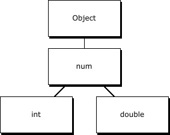

+++
slug = "2023100301"
date = "2023-10-03"
lastmod = "2023-10-03"
title = "Flutter/Dart第08天：Dart类型（内置类型、记录、集合、泛型和类型别名）"
description = "我们来继续学习Dart语言的类型，包括Dart内置类型、Record记录类型（Dart 3开始支持）、集合类型、泛型和typedef类型别名。在前面的学习中，基础内置类型、集合和泛型都有所涉及和应用，本文我们和其他类型逐一进行介绍……"
image = "00.jpg"
tags = [ "Dart", "Flutter", "跨平台" ]
categories = [ "专业技术" ]
+++

## Dart内置类型（共10类）
Dart官网文档：[https://dart.dev/language/built-in-types](https://dart.dev/language/built-in-types)

Dart内置类型即Dart SDK自带的类型，我们编程过程中可直接使用的类型，主要分为10类：
1. 数值类型：包括`int`类、`double`类等。
2. 字符串类型：即`String`类。
3. 布尔类型：即`bool`类。
4. 记录类型：即`Record`类，Dart 3中开始支持（最新版本的Java 21也支持）。
5. 列表类型：即`List`类，同时也是数组。
6. Set类型：即`Set`类。
7. 映射类型：即`Map`类。
8. 字符类型：与字符相关处理。
9. 符合类型：即Symbol类。
10. 特殊值：`null`空值。

Dart中类型的其他一些规则：
1. `Object`类是Dart中除`Null`之外的所有类的基类。扩展问题：Dart中顶层类是什么呢？
2. `Enum`类是Dart中所有枚举类的基类。扩展问题：Enum类是Object的子类吗？答案：是。
3. `dynamic`类型Dart的静态检测会失效，容易引发空安全等其他运行时错误，建议使用`Object`或者`Object?`代替。
4. `Future`和`Stream`支持异步编程。
5. `Never`一般用于总是抛出异常的函数，表明表达式用于无法成功执行。
6. `void`表明值不会被再次使用，一般用户函数返回值。

### 数字类型（int和double）
Dart中数字类型类结构如下：



`int`和`double`都是`num`类的子类。`int`为<b>不超过</b>64位的整数，`double`为64位双精度浮点数。

`num`类型支持操作：加`+`，减`-`，乘`*`，除`/`，`abs()`绝对值，`ceil()`向上取整，`floor()`向下取整操作。特别注意：<b>位</b>操作，如`>>`右移或者`<<`左移等位操作，仅`int`类型支持。

<b>代码样例：</b>如下代码，数字类型定义。

```dart
// int类型
var x = 1;
var hex = 0xDEADBEEF;

// double类型
var y = 1.1;
var exponents = 1.42e5;
double z = 1; // 等同于：double z = 1.0;

// num类型：既可以是整数，又可以是浮点数
num x = 1;
x += 2.5;
```

<b>代码样例：</b>如下代码，数字类型和字符串相互转换。

```dart
// String -> int
var one = int.parse('1');
assert(one == 1);

// String -> double
var onePointOne = double.parse('1.1');
assert(onePointOne == 1.1);

// int -> String
String oneAsString = 1.toString();
assert(oneAsString == '1');

// double -> String
String piAsString = 3.14159.toStringAsFixed(2);
assert(piAsString == '3.14');
```

<b>代码样例：</b>如下代码，`int`类型<b>位</b>操作。

```dart
assert((3 << 1) == 6); // 0011 << 1 == 0110
assert((3 | 4) == 7); // 0011 | 0100 == 0111
assert((3 & 4) == 0); // 0011 & 0100 == 0000
```

<b>代码样例：</b>如下代码，字面量数字属于编译时常量，因此字面量数字表达式也可以作为常量。

```dart
const msPerSecond = 1000;
const secondsUntilRetry = 5;
const msUntilRetry = secondsUntilRetry * msPerSecond;
```

### 字符串类型（String）
Dart中字符串是一个UTF-16的序列码，我们可以通过`'`单引号或者`"`双引号定义一个字符串、通过`${}`进行字符串插值、通过<b>相邻字符串</b>连接、使用`+`符号进行连接，通过3个单引号`'''`或者3个双引号`"""`定义多行字符串，还可以通过增加前缀`r`定义原始字符串。

<b>代码样例：</b>如下代码，字符串的各种定义方式。

```dart
// 引号：单引号或双引号
var s1 = 'Single quotes work well for string literals.';
var s2 = "Double quotes work just as well.";
var s3 = 'It\'s easy to escape the string delimiter.';
var s4 = "It's even easier to use the other delimiter.";

// 插值
final name = 'Tom';
var s5 = 'My name is $name.';
assert(s5 == 'My name is Tome.');

// 相邻字符串
var s6 = 'String '
    'concatenation'
    " works even over line breaks.";
assert(s6 ==
    'String concatenation works even over '
        'line breaks.');

var s7 = 'The + operator ' + 'works, as well.';
assert(s7 == 'The + operator works, as well.');

// 多行字符串：3个单引号或3个双引号
var s8 = '''
My name is Tom.
I am a boy.
''';

var s9 = """
My name is Tom.
I am a boy.
""";

// 原始字符串
var s10 = r'My name is Tome.\nI am a boy.';
```

<b>特别注意：</b>`==`双等于号操作符在Dart中用于检测2个对象是否相等，如果是字符串，则是校验它们的序列码是否相同（这与Java有很多的区别）。

<b>代码样例：</b>如下代码，字面量字符串是编译时常量，如果字符串插值表达式中的变量是常量，那么插值字符串也是常量。

```dart
// 字面量字符串
const aConstString = 'a constant string';

// 插值字符串常量
const aConstNum = 0;
const aConstBool = true;
const validConstString = '$aConstNum $aConstBool $aConstString';
```

### 布尔类型（bool）
Dart中只有2个对象是`bool`类型：`true`和`false`，且他们都是常量。

<b>代码样例：</b>如下代码，在表达式中的布尔类型。

```dart
// Check for an empty string.
var fullName = '';
assert(fullName.isEmpty);

// Check for zero.
var hitPoints = 0;
assert(hitPoints <= 0);

// Check for null.
var unicorn = null;
assert(unicorn == null);

// Check for NaN.
var iMeantToDoThis = 0 / 0;
assert(iMeantToDoThis.isNaN);
```

### 字符和符号（characters）
Dart中字符代表字符串中一个Unicode编码单元。Unicode为世界上的每个字母、数字和符合定义了一个唯一数字值。

由于Dart的字符串是UTF-16编码，因此Dart中表示Unicode有其对应的语法格式，常用的方式为`\uXXXX`代表一个字符，其中`XXXX`是<b>4位16进制</b>的值。

<b>举例说明：</b>心形字符♥的值为`\u2665`，如果少于或者超过4位16禁止值，则用`{}`包裹起来，如笑脸字符😁的值为`\u{1f606}`

<b>代码样例：</b>如下所示，一般我们用<b>characters</b>库来操作字符。

```dart
import 'package:characters/characters.dart';

void main() {
  var hi = 'Hi 🇩🇰';
  print(hi);
  // 结果：Hi 🇩🇰
  
  print('The end of the string: ${hi.substring(hi.length - 1)}');
  // 结果：The end of the string: ???

  final charList = hi.characters;
  for (int i = 0; i < charList.length; i++) {
    print('The character $i = ${charList.elementAt(i)}');
  }
  // 结果：
  // The character 0 = H
  // The character 1 = i
  // The character 2 =  
  // The character 3 = 🇩🇰

  print('The last character: ${hi.characters.last}');
  // The last character: 🇩🇰
}
```

<b>特别注意：</b>如上代码，因为使用了<b>characters</b>库，因此需要在`pubspec.yaml`文件中增加依赖（如下完整配置）。

```yaml
name: NTopicDart

environment:
  sdk: ^3.1.2

dependencies:
  characters: ^1.3.0
```

### 符号（Symbol）
有点类似于HTML中锚，`#`前缀，后面格式标识符。

## 记录类型（Record）
Dart官网文档：[https://dart.dev/language/records](https://dart.dev/language/records)

<b>特别注意：</b>记录类型需要Dart 3.0才开始支持（Java从JDK 21开始支持）。

Record记录类型是一个<b>匿名</b>的、<b>不可变</b>的<b>集合</b>类型。有点儿像集合类型，它是多个对象元素的集合，不一样的是，记录大小固定、异构和类型固定的。记录是一个具体的值，因此它可以作为变量、函数入参或结果、也可以嵌套（即记录中的元素是一个记录），也可以作为List/Set/Map等集合类的元素。

<b>记录语法：</b>
1. 用`()`括号包裹的，`,`逗号分隔的命名字段或者位置字段列表。
2. 记录类型注解是用`()`括号包裹的，`,`号分隔的字段类型列表，它可以作为方法入参和结果的类型。
3. 记录如果使用的是命名字段，那么字段名是记录定义的一部分，即2个记录，字段名不一样则是2个不同的记录。
4. 记录的字段内置`getters`取值方法，但是没有`setters`设置方法，因为记录是不可变的。其中命名字段的字段名即取值方法，而位置字段则使用`$<position>`字段位置取值，并且<b>忽略</b>所有的命名字段。
5. 记录比较：如果2个记录相对，那么他们必须有相同的字段、相同的字段类型，已经字段具有相同的值。
6. 记录可作为函数入参和返回值：当作为返回值，其实是一个函数可以返回多个值。

```dart
// 记录定义：位置字段+命名字段
var record = ('first', a: 2, b: true, 'last');

// 记录类型注解 
(int, int) swap((int, int) record) {
  var (a, b) = record;
  return (b, a);
}

// 记录定义和初始化
(String, int) record;
record = ('A string', 123);

({int a, bool b}) record;
record = (a: 123, b: true);

// 命令字段：字段名不一样，属于不同的记录（recordAB和recordXY是不同类型）
({int a, int b}) recordAB = (a: 1, b: 2);
({int x, int y}) recordXY = (x: 3, y: 4);


// 位置字段：类型一样即可，参数名不是记录定义的一部分
(int a, int b) recordAB = (1, 2);
(int x, int y) recordXY = (3, 4);
recordAB = recordXY;

// 取值方法：位置字段和命名字段的取值方法
var record = ('first', a: 2, b: true, 'last');
print(record.$1); // 结果：first
print(record.a);  // 结果：2
print(record.b);  // 结果：true
print(record.$2); // 结果：last

// 记录比较：相同字段、字段类型和字段值
(int x, int y, int z) point = (1, 2, 3);
(int r, int g, int b) color = (1, 2, 3);

print(point == color); // 结果：true

// 记录比较：命名字段名称不同
({int x, int y, int z}) point = (x: 1, y: 2, z: 3);
({int r, int g, int b}) color = (r: 1, g: 2, b: 3);

print(point == color); // 结果：false
```

## 集合类型（list/set/map）
Dart官方文档：[https://dart.dev/language/collections](https://dart.dev/language/collections)

list、set、map的定义和用法：[Flutter/Dart第03天：Dart可迭代集合](https://ntopic.cn/p/2023092701)

<b>代码样例：</b>如下代码，通过`...list`的方式可以展开一个集合；定义集合时，可增加<b>控制流</b>。

```dart
// 展开非null的集合
var list = [1, 2, 3];
var list2 = [0, ...list];
assert(list2.length == 4);

// 展开为null的集合
var list3;
var list2 = [0, ...?list3];
assert(list2.length == 1);

// 条件判断
var nav = ['Home', 'Furniture', 'Plants', if (promoActive) 'Outlet'];
var nav = ['Home', 'Furniture', 'Plants', if (login case 'Manager') 'Inventory'];

var listOfInts = [1, 2, 3];
var listOfStrings = ['#0', for (var i in listOfInts) '#$i'];
assert(listOfStrings[1] == '#1');
```

## 泛型类型
Dart官网文档：[https://dart.dev/language/generics](https://dart.dev/language/generics)

泛型是编码中最常见的编码方式，本文不在赘述。

## 类型别名（typedef）
Dart官网文档：[https://dart.dev/language/typedefs](https://dart.dev/language/typedefs)

<b>类型别名：</b>通过`typedef`关键字，可以给一个类型增加一个别名类型（目前还没有看到<b>别名</b>存在的必要🐶）。

```dart
// 类型别名
typedef IntList = List<int>;
IntList il = [1, 2, 3];

// 类型别名：感觉简短
typedef ListMapper<X> = Map<X, List<X>>;
Map<String, List<String>> m1 = {};
ListMapper<String> m2 = {};

// 类型别名：`不建议`把内联函数定义别名
typedef Compare<T> = int Function(T a, T b);

int sort(int a, int b) => a - b;

void main() {
  assert(sort is Compare<int>); // True
}
```

---
我的本博客原地址：[https://ntopic.cn/p/2023100301](https://ntopic.cn/p/2023100301/)

---
