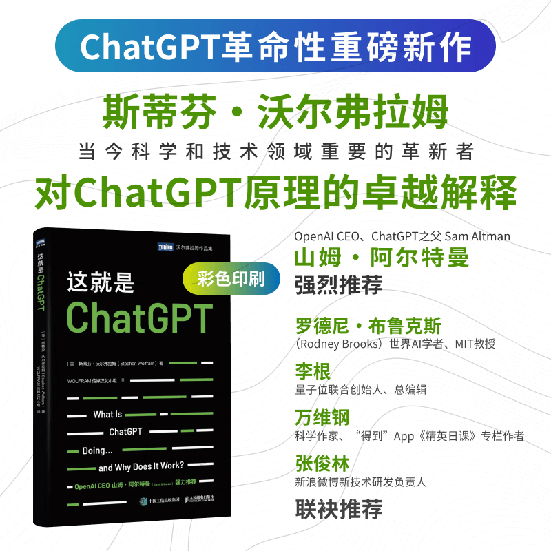

+++
slug = "2023120101"
date = "2023-12-01"
lastmod = "2023-12-01"
title = "AI人工智能·史蒂芬·沃尔弗拉姆的两个思想"
description = "2022年末OpenAI推出了ChatGPT对话机器人，拉满了人工智能（Artificial Intelligence，即AI）的火爆度。作为一名计算机从业人员，感觉如果不懂点AI都不好意思在茶前饭后愉快的聊天了。因此，从最新最简单的入手，赶紧拜读史蒂芬·沃尔弗拉姆（Stephen Wolfram）的《这就是ChatGPT》著作。可惜笔者的AI基础实在太弱，书中的很多术语很难深入理解，其中就包括计算不可约性、计算等价性原理……"
image = "00.jpg"
tags = [ "AI", "计算不可约性", "计算等价性原理" ]
categories = [ "人工智能" ]
+++

<b><big>特别说明：</big></b>以下仅仅是笔者在通过查阅网络资料后的个人理解和整理，可能无法保证完整性和正确性，仅供参考！

| 史蒂芬·沃尔弗拉姆                              | 《这就是ChatGPT》 |
| ------------------------------------------- | --------------------------------- |
|  |  |

## 计算不可约性（Computational irreducibility）
字面理解：“计算”即计算系统，应用程序等。“约”即约束、规定、明确等。整体可理解为：我们给定一个输入，无法明确一个计算系统的输出。

初步理解感觉很矛盾：程序不是我们人设计的吗，程序不就是一个“输入+函数=输出”吗，我们怎么就不能明确它的输出呢？

在这里，其实还有个额外信息，那就是这个“计算”是指“复杂的计算系统”，而不是我们为某个产品功能而设计的应用程序。

那什么又是复杂的计算系统呢？这里就引入了人工智能相关的计算系统或模型了，如ChatGPT机器人的计算系统：我们输入一个问题，经过ChatGPT后端计算系统给出一段文本；如果我们把相同的问题再次输入，ChatGPT输出的文本可能和前面一次不一样了；又或者第二天输入相同问题，得到的文本可能又不一样……

百度的文心一言：[https://yiyan.baidu.com](https://yiyan.baidu.com)

阿里的通义千问：[https://tongyi.aliyun.com](https://tongyi.aliyun.com)

我们可能会好奇，就算ChatGPT、文心一言或通义千问的后端计算系统很复杂，但它们毕竟还是我们人设计的，输出怎么就无法明确了呢？从理论上讲，是可以明确的，但实际上，我们很难做到。比如ChatGPT 3.5的计算模型据说有1700多亿个参数，这些参数相互作用相互影响，调整任何一个参数值都有可能影响最终输出；同时，在应用中，通过反馈和自学习，这些参数还在不断的调整，它们本身就一直在自变化中，在如此多的不断变化的参数的作用下，我们怎么能追踪每个参数和它们之间联系和影响，然后确定一个输出呢？

因此，最终的输出结果实际上无法明确，这就叫计算不可约性。

## 计算等价性原理（The Principle of Computational Equivalence）
这里的“计算”和上面一样，也是复杂的计算系统；“等价”即它们都足够复杂，复杂度是等价的，并无高低之分。

比如ChatGPT、文心一言或通义千问等，它们后端的计算模型都足够复杂，虽然计算模型的参数在数量级上可能有所区别，但它们一直在演进，又怎么能说谁高谁低呢？

因此，复杂计算系统之间，它们的复杂度都是等价的，不分高低。

---
我的本博客原地址：[https://ntopic.cn/p/2023120101](https://ntopic.cn/p/2023120101/)

---
