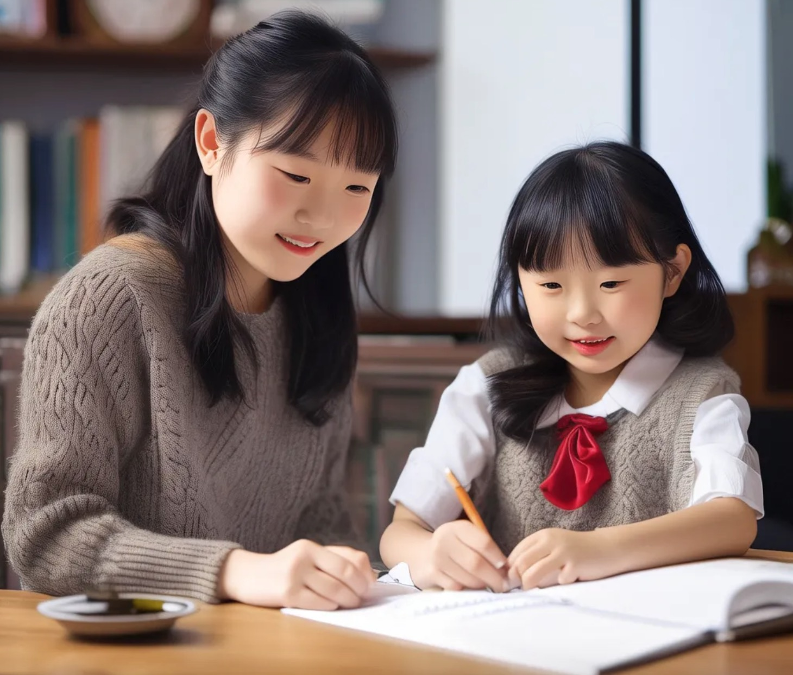

+++
slug = "2024050401"
date = "2024-05-04"
lastmod = "2024-05-04"
title = "国内免费的AI工具出色地帮我辅导女儿的小学英语作业"
description = ""
image = "00.jpg"
tags = [ "AI工具" ]
categories = [ "AI大模型" ]
+++

> 我走出学校已经 14 年多了，目前除了能粗略阅读英语技术资料之外，像如英语语法等基本功也基本离开 14 年多了。而对于小学四年级的英语，如完型填空和句式转换等基本语法是重中之重了，这些经常难倒了我。但自从有了 AI 工具，我感觉我又回到了学生时代……

## 常用的 AI 工具

AI 工具和功能有很多，比如根据文字生成图片、根据文字生成短视频等。我主要是英语基本语法类问答，主要是文字聊天。我常用的有 2 个 AI 工具：

- **文心一言**：百度出品的 ChatGPT 语言模型工具，免费使用，国内最先推出，也是我的第一个使用的 AI 工具（地址：[https://yiyan.baidu.com](https://yiyan.baidu.com/)）
- **通义千问**：阿里云出品的 ChatGPT 语言模型工具，免费使用（地址：[https://tongyi.aliyun.com/qianwen](https://tongyi.aliyun.com/qianwen/)）。我有时与**文心一言**对比一起使用，特别是在文章摘要抽取、文章润色等方面（本文不涉及，后面可发文分享）
- 网上提到的其他的国内 AI 工具，我没有使用过，读者可以尝试一下，列出几个：讯飞星火、豆包等

## AI 工具使用场景

前面提到，我使用 AI 工具源于小学四年级英语作业，下面根据作业内容逐一介绍 AI 工具的使用方法。

### 英语句子改写，非常出色

改写内容包括：改写句子为否定句、一般疑问句、一般现在时、现在进行时和对划线部分进行提问。

**题目：`Tom speaks Chinese.`**

- 问：`Tom speaks Chinese. 改成否定句。`
- 答：`Tom speaks Chinese. 改成否定句是：Tom doesn't speak Chinese.`

- 问：`Tom speaks Chinese. 改成一般疑问句。`
- 答：`Tom speaks Chinese. 改成一般疑问句是：Does Tom speak Chinese?`

- 问：`Tom speaks Chinese. 对Chinese进行提问。`
- 答：`对Tom speaks Chinese中的Chinese进行提问，我们可以问：“Tom说什么语言？”（What language does Tom speak?）`

- 问：`Tom speaks Chinese. 改成现在进行时。`
- 答：`Tom speaks Chinese. 改成现在进行时是：Tom is speaking Chinese.`

**题目：`The children are playing football.`**

- 问：`The children are playing football. 改成否定句。`
- 答：`The children are playing football. 改成否定句是：The children are not playing football. 或者可以缩写为 The children aren't playing football.`

- 问：`The children are playing football. 改成一般疑问句。`
- 答：`The children are playing football. 改成一般疑问句是：Are the children playing football?`

- 问：`The children are playing football. 对playing football进行提问。`
- 答：`对 "The children are playing football." 中的 "playing football" 进行提问，可以问：“孩子们正在做什么？”（What are the children doing?）`

- 问：`The children are playing football. 改成一般现在时。`
- 答：`"The children are playing football." 这个句子已经是现在进行时态，要改成一般现在时，我们需要知道主语“the children”是复数，所以动词“play”不需要变形。句子可以改为：The children play football.`

上面的答案，特别是划线提问、现在时改写的注意事项，是不是感觉特别出色？

### 英语完型填空（通义千问 比 文心一言 更胜一筹）

- 问：`使用play完型填空：We offen __ in the playground.`

```plaintext
We often __ in the playground.

使用“play”的适当形式填空，这里需要用到一般现在时，并且因为主语“We”是复数，所以动词“play”不需要变化。因此，正确的填空是：

We often play in the playground.
```

<p/>

- 问：`使用get完型填空：He __ up at six o'clock.`

```plaintext
He __ up at six o'clock.

使用“get”的适当形式填空，这里描述的是一个人的日常习惯，所以使用一般现在时。主语“He”是第三人称单数，因此“get”需要变成第三人称单数形式“gets”。

正确的填空是：

He gets up at six o'clock.
```

<p/>

- 问：`使用brush完型填空：__ you __ your teeth every morning?`

```plaintext
__ you __ your teeth every morning?

使用“brush”的适当形式填空，并且句子是疑问句。首先，这是一个询问日常习惯的问句，所以使用一般现在时。其次，句子需要用到“do”或“does”来帮助构成疑问句，因为“brush”是动词。由于主语“you”是第二人称，所以使用“do”。

正确的填空是：

Do you brush your teeth every morning?
```

<p/>

- 问：`使用do完型填空：What __ he usually __ after school?`

```plaintext
What __ he usually __ after school?

使用“do”的适当形式填空，并且句子是询问某人通常放学后做什么的问句。这里需要用到“do”的适当形式来帮助构成疑问句，并且主语“he”是第三人称单数。但在疑问句里，当主语是第三人称单数时，我们通常用“does”而不是“does do”。因此，“does”用来提问，后面接动词原形。

正确的填空是：

What does he usually do after school?
```

<p/>

- 问：`使用study完型填空：Danny __ English, Chinese, Maths, Science and Art at school.`

```
Danny __ English, Chinese, Maths, Science and Art at school.

使用“study”的适当形式填空，这里描述的是Danny在学校学习的科目，所以使用一般现在时。主语“Danny”是第三人称单数，因此“study”需要变成第三人称单数形式“studies”。

正确的填空是：

Danny studies English, Chinese, Maths, Science and Art at school.
```

<p/>

- 问：`使用go完型填空：Mike sometimes __ to the park with his sister.`

```plaintext
Mike sometimes __ to the park with his sister.

使用“go”的适当形式填空，描述Mike有时和他的妹妹去公园，所以使用一般现在时。主语“Mike”是第三人称单数，因此“go”需要变成第三人称单数形式“goes”。

正确的填空是：

Mike sometimes goes to the park with his sister.
```

<p/>

- 问：`使用watch完型填空：Look, she __ TV with his parents.`

**特别注意**：文心一言的回答`watches`是错误的，**通义千问**的答案正确：`is watching`

<p/>

- 问：`使用read完型填空：Mike __ English every day?`

```plaintext
Mike __ English every day?

使用“read”的适当形式填空，描述Mike每天读英语的行为，所以使用一般现在时。主语“Mike”是第三人称单数，因此“read”需要变成第三人称单数形式“reads”。

正确的填空是：

Mike reads English every day? （注意，这里句子末尾应该是一个问号，因为这是一个疑问句。）
```

<p/>

- 问：`使用have完型填空：How many lessons __ your brother __ on Monday?`

```plaintext
How many lessons __ your brother __ on Monday?

使用“have”的适当形式填空，描述你兄弟在星期一有多少节课，所以使用一般现在时。主语“your brother”是第三人称单数，因此“have”需要变成第三人称单数形式“has”。

正确的填空是：

How many lessons does your brother have on Monday?
```

<p/>

- 问：`使用do完型填空：What time __ his mother __ the housework?`

```plaintext
What time __ his mother __ the housework?

使用“do”的适当形式填空，描述他的母亲什么时间做家务，所以使用一般现在时。主语“his mother”是第三人称单数，因此需要使用“does”来帮助构成疑问句，并且后面接动词原形“do”。

正确的填空是：

What time does his mother do the housework?
```

### 英语选择填空（四选一，通义千问 比 文心一言 又更胜一筹））

- 问：`选择填空：__ he do his homework every day? A.Is B.Are C.Do D.Does`

```plaintext
选择填空的正确答案是 D. Does。

句子“__ he do his homework every day?” 是一个一般现在时的一般疑问句，询问“他每天都做作业吗？”。因为主语“he”是第三人称单数，所以需要使用助动词“does”来构成疑问句，并将动词“do”变回原形“do”。选项 A（Is）和 B（Are）都是be动词的形式，不适合用来构成这种结构的一般疑问句；选项 C（Do）虽然是一般现在时的助动词，但不适用于第三人称单数主语。因此，正确答案是 D（Does）。
```

<p/>

- 问：`选择填空：What __ they doing? A.is B.are C.do D.does`

```
选择填空的正确答案是 B. are。

句子“What __ they doing?”是一个现在进行时的疑问句，询问“他们正在做什么？”。主语“they”是复数，所以需要使用复数形式的be动词“are”来构成现在进行时。选项 A（is）是单数形式的be动词，不适合；选项 C（do）和 D（does）是一般现在时的助动词，不适用于现在进行时。因此，正确答案是 B（are）。
```

<p/>

- 问：`选择填空：__ he going to Beijing next Sunday? Yes, he is. A.Is B.Does C.Will D.Do`

**特别注意**：文心一言的回答`Will`是错误的，**通义千问**的答案正确：`Is`

<p/>

- 问：`选择填空：He never __ TV at night. A.watch B.watchs C.watching D.watches`

```plaintext
句子“He never __ TV at night.”描述的是一个人的日常习惯，所以使用一般现在时。主语“He”是第三人称单数，因此动词“watch”需要变成第三人称单数形式“watches”。

选项分析：
A. watch - 动词原形，不适合用于第三人称单数主语。
B. watchs - 这个选项实际上是不正确的，因为“watch”的第三人称单数形式是“watches”，而不是“watchs”。
C. watching - 现在分词形式，用于进行时态，不适合这里。
D. watches - 第三人称单数形式，适合用于主语“He”。

因此，正确答案是 D. watches。
```

<p/>

- 问：`选择填空：Look! The children are __ in the sea. A.swiming B.swimming C.swim D.swims`

```plaintext
选择填空的正确答案是 B. swimming。

句子“Look! The children are __ in the sea.”描述的是孩子们正在海里游泳的场景，所以需要使用现在进行时态。现在进行时态的构成是“be动词（am/is/are）+动词-ing形式”。在这里，主语“The children”是复数，所以使用“are”。动词“swim”的现在分词形式是“swimming”。

选项分析：
A. swiming - 拼写错误，正确的拼写是“swimming”。
B. swimming - 正确的现在分词形式，符合语境。
C. swim - 动词原形，不适合用于现在进行时。
D. swims - 第三人称单数形式，不适合用于复数主语。

因此，正确答案是 B. swimming。
```

<p/>

- 问：`选择填空：How many apples __ he eat every day? A.is B.are B.do D.does`

```plaintext
选择填空的正确答案是 D. does。

句子“How many apples __ he eat every day?”是一个询问数量的疑问句，询问“他每天吃多少个苹果？”。由于主语“he”是第三人称单数，我们需要一个助动词来帮助构成疑问句，并将动词“eat”变为原形。在这里，我们要使用“does”作为第三人称单数的助动词。

选项分析：
A. is - be动词的单数形式，不适合在这里使用。
B. are - be动词的复数形式，也不适合。
C. do - 一般现在时的助动词，用于第一人称和第二人称单数及复数，以及第三人称复数。但在这里，主语是第三人称单数，所以不适用。
D. does - 一般现在时的助动词，用于第三人称单数，符合这里的语境。

因此，正确答案是 D. does。
```

<p/>

- 问：`选择填空：__ he listening to the music? A.Do B.Does C.Is D.Are`

```plaintext
选择填空的正确答案是 C. Is。

句子“__ he listening to the music?”是一个现在进行时态的疑问句，询问“他正在听音乐吗？”。在现在进行时态的疑问句中，我们需要使用“be动词（am/is/are）+主语+动词-ing形式”的结构。由于主语“he”是第三人称单数，所以应该使用“is”。

选项分析：
A. Do - 用于第一人称、第二人称及第三人称复数主语的一般现在时态疑问句中，但不适用于现在进行时态。
B. Does - 用于第三人称单数主语的一般现在时态疑问句中，同样不适用于现在进行时态。
C. Is - 第三人称单数的be动词形式，用于现在进行时态疑问句中，符合这里的语境。
D. Are - 第二人称及第一人称复数、第三人称复数的be动词形式，不适用于这里的主语“he”。

因此，正确答案是 C. Is。
```

<p/>

- 问：`选择填空：There __ some pens in the box. A.is B.do C.are D.have`

```plaintext
选择填空的正确答案是 C. are。

句子“There __ some pens in the box.”是一个存在句，描述盒子里有一些钢笔。在存在句中，当主语是可数名词复数时，我们需要使用“be动词”的复数形式“are”。

选项分析：
A. is - 用于第三人称单数主语或不可数名词，但这里的主语“pens”是可数名词复数，所以不适用。
B. do - 是助动词，用于构成疑问句或否定句，不适用于存在句。
C. are - 是“be动词”的复数形式，适用于主语为可数名词复数的情况，所以是正确的。
D. have - 是动词，表示“有”，但在存在句中我们通常使用“there be”结构，而不是“have”。

因此，正确答案是 C. are。
```

<p/>

- 问：`选择填空：Where __ they always to every Sunday? A.are B.is C.do D.does`

```plaintext
选择填空的正确答案是 C. do。

句子“Where __ they always go every Sunday?”是一个询问他们每周日都去哪里的一般现在时态的疑问句。我们需要一个助动词来帮助构成疑问句，并且动词“go”需要保持原形。

选项分析：
A. are - be动词的复数形式，通常用于现在进行时或一般现在时的主语为复数的情况，但在此句中不合适，因为它无法与动词“go”连用构成疑问句。
B. is - be动词的单数形式，同样无法与动词“go”连用构成疑问句。
C. do - 助动词，用于第一人称、第二人称及第三人称复数的疑问句或否定句中，可以与动词“go”连用构成疑问句。
D. does - 助动词的第三人称单数形式，用于第三人称单数的疑问句或否定句中，但在此处主语为“they”（复数），所以不适用。

因此，正确答案是 C. do。完整的句子应该是：“Where do they always go every Sunday?”
```

<p/>

- 问：`选择填空：We __ dinner at 6:30 every day. A.eat B.eats C.eating D.eatting`

```plaintext
选择填空的正确答案是 A. eat。

句子“We __ dinner at 6:30 every day.”描述的是“我们每天6:30吃晚饭”这一日常习惯，因此应该使用一般现在时。主语“We”是第一人称复数，所以动词需要使用原形。

选项分析：
A. eat - 动词原形，适用于第一人称复数主语的一般现在时，符合语境。
B. eats - 第三人称单数形式，不适用于第一人称复数主语。
C. eating - 现在分词形式，通常用于进行时态，不适用于一般现在时。
D. eatting - 这是错误的拼写，正确的现在分词形式是“eating”，但即使拼写正确，它也不适用于这个句子。

因此，正确答案是 A. eat。
```

### 英语：AI 工具其他出色的问答

- 问：`请列出应用中所有的第1人称、第2人称和第3人称`

```plantext
当然可以，以下是英语中所有主要的人称代词形式，按照第一人称、第二人称和第三人称进行分类，并包括单数和复数形式以及主格和宾格：

### 第一人称：
- 单数：
  - 主格：I（我）
  - 宾格：me（我）
- 复数：
  - 主格：we（我们）
  - 宾格：us（我们）
- 物主代词：
  - 形容词性物主代词：my（我的），our（我们的）
  - 名词性物主代词：mine（我的东西），ours（我们的东西）

### 第二人称：
- 单数：
  - 主格：you（你）
  - 宾格：you（你）
- 复数：
  - 主格：you（你们）
  - 宾格：you（你们）
- 物主代词：
  - 形容词性物主代词：your（你的/你们的）
  - 名词性物主代词：yours（你的/你们的东西）

### 第三人称：
- 单数：
  - 主格：he（他），she（她），it（它）
  - 宾格：him（他），her（她），it（它）
- 复数：
  - 主格：they（他们/她们/它们）
  - 宾格：them（他们/她们/它们）
- 物主代词：
  - 形容词性物主代词：his（他的），her（她的），its（它的）
  - 名词性物主代词：his（他的东西），hers（她的东西），its（它的东西），theirs（他们的/她们的/它们的东西）

以上涵盖了英语中最基本和常用的人称代词形式。在实际应用中，根据上下文和语法需要选择合适的人称和格的形式。
```

### 文生图（`通义千问`在胜`文心一言`一筹）

- 问（**通义千问**）：`请帮忙画一副中国父母辅导10女儿做英语作业的画面`



**文心一言**生成的图片答非所问，不知所云，图片我就不放上来了。

## 国内免费 AI 工具总结

我主要使用`文心一言`和`通义千问`这 2 个国内免费 AI 工具，从上面的四年级英语作业测试可以看出，他们 2 者在*句子改写*能力表现一致，结果都符合预期。但：

- 在*完型填空*和*选择填空*作业方面，**通义千问**的正确率达到 100%，而**文心一言**分别出现了 1 次错误（共 2 次错误），**通义千问**更胜一筹。

- 在*文生图*方面，**文心一言**生成的图片简直完全不符合预期了，而**通义千问**至少能理解我的意思，画出的图片也有模有样，因此在胜一筹。

---

我的本博客原地址：[https://ntopic.cn/p/2024050401](https://ntopic.cn/p/2024050401/)

---


