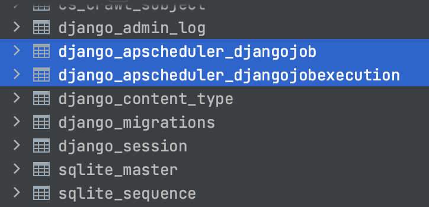

+++
slug = "2024060101"
date = "2024-06-01"
lastmod = "2024-06-01"
title = "【Django技术深潜】揭秘Django定时任务利器：django_apscheduler全面解析与实战"
description = "本文分析了Django定时任务不同的实现方式的优劣，然后深入探讨Django定时任务解决方案，特别是django_apscheduler定时任务库，最后进行了实战应用。"
image = "02.jpg"
tags = [ "AI工具", "故事创意", "视频制作" ]
categories = [ "人工智能" ]
+++

在现代Web开发中，定时任务是不可或缺的一部分，无论是定期数据分析、定时发送邮件、还是系统维护脚本，都需要精准的定时调度。Django作为Python世界中强大的Web框架，其对定时任务的支持自然也是开发者关注的重点。本文将深入探讨Django定时任务解决方案，特别是聚焦于`django_apscheduler`这一强大扩展库，带您领略其背后的运行原理与实战应用，助您在Django项目中高效驾驭定时任务。

## 一、Django定时任务组件概览

在Django世界中，实现定时任务主要有以下几种方式：

1. **使用while True循环**：研发直接简单，不依赖任何其他Python库，但包括调度时间、调度频率、任务管理等在内均无法实现。代码样例如下：
```python
import time

# 定时任务1
def task1():
    print("hello,world")

# 定时任务2
def task2():
    print("hello,world")

if __name__ == '__main__':
    while True:
        task1()
        task1()
        time.sleep(7) # 调度频率：每7秒调度一次
```
2. **使用cron jobs**：传统方式，通过操作系统级别的cron服务安排定时任务，但与Django应用解耦，配置和管理相对独立。
3. **基于Django的自定义管理命令**：借助Django自定义管理命令能力，通过编写命令行脚本，再借助cron或任务调度系统执行，灵活性高但集成度较低。
4. **集成第三方库**（推荐）：使用Django三方库，如`django_cron`、`django_schedule`，以及我们今天的主角`django_apscheduler`，这些库提供更紧密的Django集成和更丰富的功能。

## 二、为何选择django_apscheduler库

相较于其他几种方案，`django_apscheduler`凭借其与Django的集成度、强大的功能、灵活的配置等特点脱颖而出：

- **无缝集成**：作为APScheduler的Django适配器，它直接在Django应用中提供高级定时任务功能，无需额外配置cron作业。
- **高级调度**：支持复杂调度逻辑，如周期性任务、一次性任务、cron风格表达式等，满足多样化需求。
- **数据库支持**：默认使用Django的数据库作为作业存储，易于管理任务状态和历史记录，尤其适合分布式部署。同时，定时任务的定义、执行状态等都会被持久化到数据库中，应用重启后的状态**可恢复。
- **灵活的执行器**：可选ThreadPoolExecutor或ProcessPoolExecutor，控制并发执行，适应不同任务类型。

## 三、django_apscheduler运行原理探秘

`django_apscheduler`的核心在于将APScheduler与Django框架紧密结合。其背后的工作机制主要包括：

- **初始化与调度**：应用启动后初始化`BackgroundScheduler`实例，加载并调度所有配置好的定时任务。
- **作业存储**：利用Django的ORM框架，将任务信息存储在Django应用数据库中，实现任务的持久化和分布式跨进程共享。
- **执行器与任务执行**：当到达任务触发时间，执行器（线程池或进程池）会根据配置执行任务。任务执行结果和状态会被记录，便于追踪和审计。

## 四、实战演练：用django_apscheduler构建定时任务

接下来，让我们通过一个简单示例，感受`django_apscheduler`的实战魅力：

1. **安装库**：首先，通过pip安装`django-apscheduler`：

```shell
pip install django-apscheduler
```

2. **配置定时任务**：其次，在`settings.py`中注册`django_apscheduler`应用：

```python
INSTALLED_APPS = [
    'django.contrib.admin',
    'django.contrib.auth',
    'django.contrib.contenttypes',
    'django.contrib.sessions',
    'django.contrib.messages',
    'django.contrib.staticfiles',
    # ....其他APP....
    'django_apscheduler',
    # ....其他APP....
]

# 时间格式化
APSCHEDULER_DATETIME_FORMAT = '%Y-%m-%d %H:%M:%S.%f'

# 任务超时时间（单位：秒）
APSCHEDULER_RUN_NOW_TIMEOUT = 600
```

3. **创建定时任务数据表**：执行Django数据迁移管理命令，创建数据表：

```shell
python manage.py migrate
```



数据表的定义如下：

```sql
-- SELECT sql FROM sqlite_master WHERE type='table' AND name='django_apscheduler_djangojob';
CREATE TABLE "django_apscheduler_djangojob"
(
    "id"            varchar(255) NOT NULL PRIMARY KEY,
    "next_run_time" datetime NULL,
    "job_state"     BLOB         NOT NULL
);

-- SELECT sql FROM sqlite_master WHERE type='table' AND name='django_apscheduler_djangojobexecution';
CREATE TABLE "django_apscheduler_djangojobexecution"
(
    "id"        integer      NOT NULL PRIMARY KEY AUTOINCREMENT,
    "status"    varchar(50)  NOT NULL,
    "run_time"  datetime     NOT NULL,
    "duration"  decimal NULL,
    "finished"  decimal NULL,
    "exception" varchar(1000) NULL,
    "traceback" text NULL,
    "job_id"    varchar(255) NOT NULL REFERENCES "django_apscheduler_djangojob" ("id") DEFERRABLE INITIALLY DEFERRED,
    CONSTRAINT "unique_job_executions" UNIQUE ("job_id", "run_time")
);
```

4. **编写任务逻辑**：在任一一个Django应用中（比如：该App为`task`），创建任务模块`task_list.py`：

```python
# ./task/task_list.py

from datetime import datetime

def print_task():
    print('Scheduler测试任务执行：{}'.format(datetime.now().strftime('%Y-%m-%d %H:%M:%S.%f')))
```

5. **注册任务**：通过Django自定义管理命令，设置调度规则，启动`django_apscheduler`调度器：

在`task`App中，创建如下结果目录，配置Django自定义管理命令：

```shell
$ tree management/
management/
├── __init__.py
└── commands
    ├── __init__.py
    └── start_tasks.py
```

+ 目录中的2个`__init__.py`文件是标记文件，内容为空，仅代表目标是一个模块
+ 文件`./task/management/commands/start_tasks.py`代表自定义命令，Django默认会扫描每个App的`/management/commands`目录，该目录下的所有**文件名**均可作为命令，如`start_tasks.py`的管理命令为：`python manage.py start_tasks`

```python
# ./task/management/commands/start_tasks.py
from datetime import datetime

from apscheduler.executors.pool import ThreadPoolExecutor
from apscheduler.schedulers.blocking import BlockingScheduler
from apscheduler.triggers.interval import IntervalTrigger
from django.conf import settings
from django.core.management.base import BaseCommand
from django_apscheduler import util
from django_apscheduler.jobstores import DjangoJobStore
from django_apscheduler.models import DjangoJobExecution

from ...task_list import print_task

#
# Django manage.py命令：存储定时任务信息
#
class Command(BaseCommand):
    help = '启动定时任务.'

    def handle(self, *args, **options):
        # 调度器
        scheduler = BlockingScheduler(timezone=settings.TIME_ZONE) # 研发阶段使用
        # scheduler = BackgroundScheduler(timezone=settings.TIME_ZONE) # 生产阶段使用

        # 任务存储
        scheduler.add_jobstore(DjangoJobStore(), 'SQLiteJobStore')

        # 配置线程池执行器，限制最大并发数为1，防止并发
        executor = ThreadPoolExecutor(max_workers=1)
        scheduler.executor = executor

        # 注册定义任务
        id_print_task =  'print_task__job'
        print('开始-增加任务({})'.format(id_print_task))
        scheduler.add_job(
            print_task,
            id=id_print_task,
            name=id_print_task,
            max_instances=1,
            replace_existing=True,
            trigger=IntervalTrigger(seconds=15, start_date=datetime.now(), ), # 从当前时间开始，每15秒钟调度一次
        )
        print('完成-增加任务({})'.format(id_print_task))

        # 启动定时任务
        try:
            scheduler.start()
        except KeyboardInterrupt:
            scheduler.shutdown()
```

至此，任务配置完成：每15秒钟调度一次我们自定义任务。

6. **启动任务**：利用Django管理命令，启动定时任务

```shell
python manage.py start_tasks
```

由于我们用的调度器是`BlockingScheduler`，启动之后命令行不退出，在DEV研发阶段，建议采用这个调度器；生成环境，建议采用`BackgroundScheduler`调度器，通过后台守护进程执行定时任务。

## 五、总结

`django_apscheduler`以其高度集成、灵活配置和强大的功能，成为Django项目中定时任务解决方案的优选。它不仅简化了定时任务的实现，还提升了任务管理的便捷性和系统的稳定性。无论你是初次接触定时任务的新手，还是寻求高效解决方案的老手，`django_apscheduler`都是值得深入了解和掌握的工具。希望本文能为你在Django定时任务的探索之路上点亮一盏明灯。

---

关注本公众号，我们共同学习进步 👇🏻👇🏻👇🏻


---

我的本博客原地址：[https://ntopic.cn/p/2024053101](https://ntopic.cn/p/2024053101/)

---
