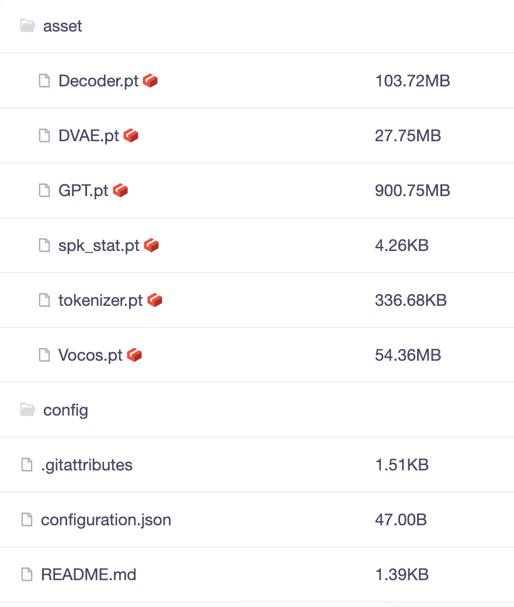

+++
slug = "2024060901"
date = "2024-06-09"
lastmod = "2024-06-09"
title = "ChatTTS 开源文本转语音模型本地部署、API使用和搭建WebUI界面（建议收藏）"
description = "ChatTTS是一款专为对话场景设计的支持中英文的文本转语音（TTS）模型，能够生成高质量、自然流畅的对话语音，同时还支持笑声、停顿等韵律特征，超越了大部分TTS开源模型。本文手把手部署、AIP使用、搭建可视化WebUI界面体验ChatTTS能力……"
image = "00.jpg"
tags = [ "AI工具", "ChatTTS", "大模型", "TTS" ]
categories = [ "人工智能" ]
+++

**ChatTTS**（Chat Text To Speech）是专为对话场景设计的文本生成语音(TTS)模型，特别适用于大型语言模型(**LLM**)助手的对话任务，以及诸如对话式音频和视频介绍等应用。它支持中文和英文，还可以穿插笑声、说话间的停顿、以及语气词等，听起来很真实自然，在语音合成中表现出高质量和自然度（ChatTTS团队声称：**突破开源天花板**）。

同时，**ChatTTS**模型文件总大小**1.1GB**左右，常用的个人笔记本电脑均可部署，因此涉及到文本转语音场景，均可以自己操作转换了！

## ChatTTS特点

由于ChatTTS以下极具吸引人的特点，使得它一经推出就成为了爆款：

+ **多语言支持**：ChatTTS的一个关键特性是支持多种语言，包括英语和中文。这使其能够为广泛用户群提供服务，并克服语言障碍。
+ **大规模数据训练**：ChatTTS使用了大量数据进行训练，大约有1000万小时的中文和英文数据。这样的大规模训练使其声音合成质量高，听起来自然。
+ **对话任务兼容性**：ChatTTS很适合处理通常分配给大型语言模型LLMs的对话任务。它可以为对话生成响应，并在集成到各种应用和服务时提供更自然流畅的互动体验。
+ **开源计划**：ChatTTS团队目前开源一个经过训练的基础模型。
+ **控制和安全性**：ChatTTS致力于提高模型的可控性，添加水印，并将其与LLMs集成。这些努力确保了模型的安全性和可靠性。
+ **易用性**：ChatTTS为用户提供了易于使用的体验。它只需要文本信息作为输入，就可以生成相应的语音文件。这样的简单性使其方便有语音合成需求的用户。

## 下载ChatTTS模型文件

因最大模型文件超过**900MB**，为了防止使用Git无法直接下载到本地，我们通过**git-lfs**工具包下载：

```shell
brew install git-lfs
```

通过Git复制模型文件到笔记本电脑（文件夹：`ChatTTS-Model`）：

```shell
git lfs install
git clone https://www.modelscope.cn/pzc163/chatTTS.git ChatTTS-Model
```

如果因网络不佳等原因，下载中断，我们可以通过以下命令在中断后继续下载：

```shell
git lfs pull
```



## 安装ChatTTS依赖包列表

下载**ChatTTS**官网GitHub源码：

```
git clone https://gitcode.com/2noise/ChatTTS.git ChatTTS
```

进入源码目录，批量安装**Python依赖包**：

```
pip install -r requirements.txt
```

**特别注意**：如果下载过程中，若出现找不到`torch`的**2.1.0**版本错误，请修改`requirements.txt`文件，把`torch`的版本修改为**2.2.2**后再次执行安装：


Python依赖包列表`requirements.txt`文件如下，我们也可以手工一个一个的进行安装，无需下载整个源码（注意：`torch`的版本号为**2.2.2**）：

```plaintext
omegaconf~=2.3.0
torch~=2.2.2
tqdm
einops
vector_quantize_pytorch
transformers~=4.41.1
vocos
IPython
```

## ChatTTS中文文本转音频文件

**特别注意**：经老牛同学的验证，**ChatTTS**官网的样例代码API已经过时，无法直接运行，特别是`chat.load_models`方法入参是错误的，下面是老牛同学通过阅读API入参且验证的可执行代码。

```python
# ChatTTS-01.py

import ChatTTS
import torch
import torchaudio

# 第一步下载的ChatTTS模型文件目录，请按照实际情况替换
MODEL_PATH = '/Users/obullxl/PythonSpace/ChatTTS-Model'

# 初始化并加载模型，特别注意加载模型参数，官网样例代码已经过时，请使用老牛同学验证代码
chat = ChatTTS.Chat()
chat.load_models(
    vocos_config_path=f'{MODEL_PATH}/config/vocos.yaml',
    vocos_ckpt_path=f'{MODEL_PATH}/asset/Vocos.pt',
    gpt_config_path=f'{MODEL_PATH}/config/gpt.yaml',
    gpt_ckpt_path=f'{MODEL_PATH}/asset/GPT.pt',
    decoder_config_path=f'{MODEL_PATH}/config/decoder.yaml',
    decoder_ckpt_path=f'{MODEL_PATH}/asset/Decoder.pt',
    tokenizer_path=f'{MODEL_PATH}/asset/tokenizer.pt',
)

# 需要转化为音频的文本内容
text = '大家好，我是老牛，微信公众号：老牛同学。很高兴与您相遇，专注于编程技术、大模型及人工智能等相关技术分享，欢迎关注和转发，让我们共同启程智慧之旅！'

# 文本转为音频
wavs = chat.infer(text, use_decoder=True)

# 保存音频文件到本地文件（采样率为24000Hz）
torchaudio.save("./output/output-01.wav", torch.from_numpy(wavs[0]), 24000)
```

运作Python代码：`python ChatTTS-01.py`

```plaintext
$ python ChatTTS-01.py
WARNING:ChatTTS.utils.gpu_utils:No GPU found, use CPU instead
INFO:ChatTTS.core:use cpu
INFO:ChatTTS.core:vocos loaded.
INFO:ChatTTS.core:gpt loaded.
INFO:ChatTTS.core:decoder loaded.
INFO:ChatTTS.core:tokenizer loaded.
WARNING:ChatTTS.core:dvae not initialized.
INFO:ChatTTS.core:All initialized.
 20%|██████████████████████████▌                    | 76/384 [00:08<00:35,  8.62it/s]
 26%|██████████████████████████████████▌            | 536/2048 [00:48<02:17, 10.98it/s]
```

上述文本转音频程序执行完成，在本地目录生成了`./output/output-01.wav`音频文件，打开该音频文件，就可以听到非常自然流畅的语音了！

我们也可以在文本转换成语音之后，直接播放语音内容：

```python
# …… 其他包引用省略
from IPython.display import Audio

# …… 其他部分代码省略

# 播放生成的音频（autoplay=True 代表自动播放）
Audio(wavs[0], rate=24000, autoplay=True)
```

## 快速搭建WebUI界面

上面我们通过Python代码生成了音频文件，操作起来比较麻烦，现在我们构建一个WebUI可视化界面：

首先安装Python依赖包，列表如下：

```shell
pip install omegaconf~=2.3.0 transformers~=4.41.1
pip install tqdm einops vector_quantize_pytorch vocos
pip install modelscope gradio
```

运行Python程序，即可看到可视化界面，我们可以随意输入文本来生成音频文件了：


```python
# ChatTTS-WebUI.py

import random

import ChatTTS
import gradio as gr
import numpy as np
import torch
from ChatTTS.infer.api import refine_text, infer_code

print('启动ChatTTS WebUI......')

# WebUI设置
WEB_HOST = '127.0.0.1'
WEB_PORT = 8089

MODEL_PATH = '/Users/obullxl/PythonSpace/ChatTTS-Model'

chat = ChatTTS.Chat()
chat.load_models(
    vocos_config_path=f'{MODEL_PATH}/config/vocos.yaml',
    vocos_ckpt_path=f'{MODEL_PATH}/asset/Vocos.pt',
    gpt_config_path=f'{MODEL_PATH}/config/gpt.yaml',
    gpt_ckpt_path=f'{MODEL_PATH}/asset/GPT.pt',
    decoder_config_path=f'{MODEL_PATH}/config/decoder.yaml',
    decoder_ckpt_path=f'{MODEL_PATH}/asset/Decoder.pt',
    tokenizer_path=f'{MODEL_PATH}/asset/tokenizer.pt',
)


def generate_seed():
    new_seed = random.randint(1, 100000000)
    return {
        "__type__": "update",
        "value": new_seed
    }


def generate_audio(text, temperature, top_P, top_K, audio_seed_input, text_seed_input, refine_text_flag):
    torch.manual_seed(audio_seed_input)
    rand_spk = torch.randn(768)
    params_infer_code = {
        'spk_emb': rand_spk,
        'temperature': temperature,
        'top_P': top_P,
        'top_K': top_K,
    }
    params_refine_text = {'prompt': '[oral_2][laugh_0][break_6]'}

    torch.manual_seed(text_seed_input)

    text_tokens = refine_text(chat.pretrain_models, text, **params_refine_text)['ids']
    text_tokens = [i[i < chat.pretrain_models['tokenizer'].convert_tokens_to_ids('[break_0]')] for i in text_tokens]
    text = chat.pretrain_models['tokenizer'].batch_decode(text_tokens)
    # result = infer_code(chat.pretrain_models, text, **params_infer_code, return_hidden=True)

    print(f'ChatTTS微调文本：{text}')

    wav = chat.infer(text,
                     params_refine_text=params_refine_text,
                     params_infer_code=params_infer_code,
                     use_decoder=True,
                     skip_refine_text=True,
                     )

    audio_data = np.array(wav[0]).flatten()
    sample_rate = 24000
    text_data = text[0] if isinstance(text, list) else text

    return [(sample_rate, audio_data), text_data]


def main():
    with gr.Blocks() as demo:
        default_text = "大家好，我是老牛同学，微信公众号：老牛同学。很高兴与您相遇，专注于编程技术、大模型及人工智能等相关技术分享，欢迎关注和转发，让我们共同启程智慧之旅！"
        text_input = gr.Textbox(label="输入文本", lines=4, placeholder="Please Input Text...", value=default_text)

        with gr.Row():
            refine_text_checkbox = gr.Checkbox(label="文本微调开关", value=True)
            temperature_slider = gr.Slider(minimum=0.00001, maximum=1.0, step=0.00001, value=0.8, label="语音温度参数")
            top_p_slider = gr.Slider(minimum=0.1, maximum=0.9, step=0.05, value=0.7, label="语音top_P采样参数")
            top_k_slider = gr.Slider(minimum=1, maximum=20, step=1, value=20, label="语音top_K采样参数")

        with gr.Row():
            audio_seed_input = gr.Number(value=42, label="语音随机数")
            generate_audio_seed = gr.Button("\U0001F3B2")
            text_seed_input = gr.Number(value=42, label="文本随机数")
            generate_text_seed = gr.Button("\U0001F3B2")

        generate_button = gr.Button("文本生成语音")

        text_output = gr.Textbox(label="微调文本", interactive=False)
        audio_output = gr.Audio(label="语音")

        generate_audio_seed.click(generate_seed,
                                  inputs=[],
                                  outputs=audio_seed_input)

        generate_text_seed.click(generate_seed,
                                 inputs=[],
                                 outputs=text_seed_input)

        generate_button.click(generate_audio,
                              inputs=[text_input, temperature_slider, top_p_slider, top_k_slider, audio_seed_input, text_seed_input, refine_text_checkbox],
                              outputs=[audio_output, text_output, ])

    # 启动WebUI
    demo.launch(server_name='127.0.0.1', server_port=8089, share=False, show_api=False, )


if __name__ == '__main__':
    main()
```

最后，运行WebUI程序，就可以享受可视化文本生成语音功能了：`python ChatTTS-WebUI.py`

---

关注本公众号，我们共同学习进步👇🏻👇🏻👇🏻


---

我的本博客原地址：[https://mp.weixin.qq.com/s/rL3vyJ_xEj7GGoKaxUh8_A](https://mp.weixin.qq.com/s/rL3vyJ_xEj7GGoKaxUh8_A)

部署**Llama 3 8B**开源大模型：[玩转 AI，笔记本电脑安装属于自己的 Llama 3 8B 大模型和对话客户端](https://mp.weixin.qq.com/s/MekCUJDhKzuUnoykkGoH2g)

部署**Llama 3 8B**Web版对话机器人：[一文彻底整明白，基于 Ollama 工具的 LLM 大语言模型 Web 可视化对话机器人部署指南](https://mp.weixin.qq.com/s/2DVYO75h0o5EHN_K_GF4Eg)

部署中文版**Llama 3（Llama3-Chinese-Chat）**大模型：[基于Llama 3搭建中文版（Llama3-Chinese-Chat）大模型对话聊天机器人](https://mp.weixin.qq.com/s/idcdIr8mMWDQ_iZU5r_UEQ)

---
