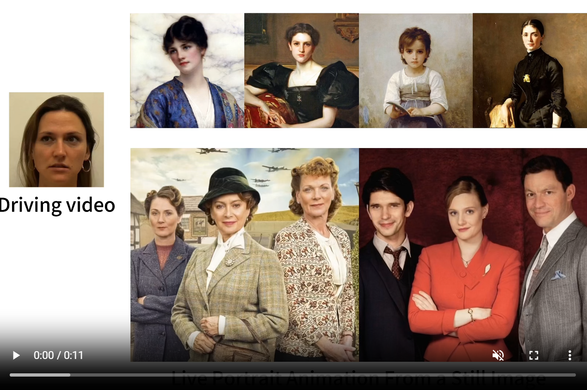

+++
slug = "2024071401"
date = "2024-07-14"
lastmod = "2024-07-14"
title = "LivePortrait 数字人：开源的图生视频模型，本地部署和专业视频制作详细教程"
description = "最近数字人比较火，LivePortrait 是快手、中科大和复旦大学联合研发的开源的图生视频模型，比较适合个人、小团体和企业等用于生成自己的数字化人物视频。老牛同学尝试通过本教程，详细介绍如何在本地部署和生成专业视频……"
image = "https://modelscope.cn/api/v1/models/AI-ModelScope/LivePortrait/repo?Revision=master&FilePath=.%2Fdocs%2Fshowcase2.gif&View=true"
tags = [ "AI", "LivePortrait", "图生视频" ]
categories = [ "人工智能" ]
+++


看到上面面部表情动态图片，是不是感觉挺有有意思？它就是通过快手、中科大和复旦大学联合研发的**图生视频**开源大模型**LivePortrait**（灵动人像）生成的视频。通过**LivePortrait**大模型，我们只需要一张人脸正面图片和一段文字或音频，即可制作专业的视频内容，例如产品介绍、教学课程、趣味视频等。



有关**LivePortrait**更多的展示样例参见：[https://liveportrait.github.io/](https://liveportrait.github.io)

老牛同学将和大家一起，在本地部署**LivePortrait**图生视频大模型，并且生成我们自己的视频。本文将包括以下几部分：

1. 基础环境准备：与我们之前部署 LLM 大模型不同，**LivePortrait**涉及到音频和视频等多媒体数据的处理，因此环境要稍微复杂一点
2. LivePortrait 配置：包括大模型权重文件下载、配置等
3. LivePortrait 使用：包括通过图片生成视频、Web 界面可视化生成视频等（建议配合 GPU 进行使用，老牛同学**纯 CPU**推理速度较慢）

LivePortrait 理论研究，可以参见论文：[https://arxiv.org/pdf/2407.03168](https://arxiv.org/pdf/2407.03168)

## LivePortrait 基础环境准备

基础环境准备分为以下 3 步：克隆 GitHub 示例源代码、安装 Python 依赖包和下载配置**FFmpeg**音视频工具库

【第一步：下载 GitHub 示例源码】

GitHub 示例源码下载目录：`LivePortrait`

```shell
git clone https://github.com/KwaiVGI/LivePortrait
```

**特别注意：** 示例代码克隆成功之后，我们可以看到示例源码目录`LivePortrait`下，有个`pretrained_weights`空目录，它就是用来存放预训练权重文件的目录，接下来的我们会下载权重文件！

【第二步：安装 Python 依赖包】

切换到 GitHub 示例源码目录：`cd LivePortrait`

```shell
# 激活环境：特别注意Python版本为3.9.18，其他版本可能不支持（老牛同学3.12就不支持）
conda create -n LivePortrait python==3.9.18
conda activate LivePortrait

# 安装依赖包
pip install -r requirements.txt
```

如果**Miniconda**还未完成安装，建议先提前安装好：[大模型应用研发基础环境配置（Miniconda、Python、Jupyter Lab、Ollama 等）](https://mp.weixin.qq.com/s/P_ufvz4MWVSqv_VM-rJp9w)

【第三步：下载和配置 FFmpeg 音视频工具库】

**FFmpeg** 是一个非常强大的开源软件工具库，主要用于处理多媒体数据，包括音频和视频的编码、解码、转码、复用、解复用、流媒体传输以及播放等。

我们可以通过 FFmpeg 官网下载：[https://ffmpeg.org/download.html](https://ffmpeg.org/download.html)

或者，老牛同学已经下载好了，放到了百度网盘（评论区也有地址）：[https://pan.baidu.com/s/1IYutMbJGJSxLVY56-h4IPg?pwd=LNTX](https://pan.baidu.com/s/1IYutMbJGJSxLVY56-h4IPg?pwd=LNTX)

下载安装好之后，把 FFmpeg 目录设置在`PATH`环境变量中，同时执行命令进行检测：`ffmpeg -version`

```plaintext
>ffmpeg -version
ffmpeg version 7.0.1-essentials_build-www.gyan.dev Copyright (c) 2000-2024 the FFmpeg developers
built with gcc 13.2.0 (Rev5, Built by MSYS2 project)
configuration: --enable-gpl --enable-version3 --enable-static --disable-w32threads --disable-autodetect --enable-fontconfig --enable-iconv --enable-gnutls --enable-libxml2 --enable-gmp --enable-bzlib --enable-lzma --enable-zlib --enable-libsrt --enable-libssh --enable-libzmq --enable-avisynth --enable-sdl2 --enable-libwebp --enable-libx264 --enable-libx265 --enable-libxvid --enable-libaom --enable-libopenjpeg --enable-libvpx --enable-mediafoundation --enable-libass --enable-libfreetype --enable-libfribidi --enable-libharfbuzz --enable-libvidstab --enable-libvmaf --enable-libzimg --enable-amf --enable-cuda-llvm --enable-cuvid --enable-dxva2 --enable-d3d11va --enable-d3d12va --enable-ffnvcodec --enable-libvpl --enable-nvdec --enable-nvenc --enable-vaapi --enable-libgme --enable-libopenmpt --enable-libopencore-amrwb --enable-libmp3lame --enable-libtheora --enable-libvo-amrwbenc --enable-libgsm --enable-libopencore-amrnb --enable-libopus --enable-libspeex --enable-libvorbis --enable-librubberband
libavutil      59.  8.100 / 59.  8.100
libavcodec     61.  3.100 / 61.  3.100
libavformat    61.  1.100 / 61.  1.100
libavdevice    61.  1.100 / 61.  1.100
libavfilter    10.  1.100 / 10.  1.100
libswscale      8.  1.100 /  8.  1.100
libswresample   5.  1.100 /  5.  1.100
libpostproc    58.  1.100 / 58.  1.100
```

## LivePortrait 模型权重下载和配置

我们可以通过多种方式下载预训练权重文件，包括 HF 和云盘等：

【方式一：HF 下载权重文件】

由于文件比较大，Git 无法直接下载，首先需要设置 Git 大文件环境：

```shell
git lfs install
```

然后克隆权重文件，下载的目录：`pretrained_weights`

```shell
git clone https://www.modelscope.cn/AI-ModelScope/LivePortrait.git pretrained_weights
```

由于文件比较大，Git 在克隆过程中可能会中断，我们可以通过 Git 命令重试：

```shell
# 切换到权重文件目录
cd pretrained_weights

# 继续中断下载
git lfs pull
```

【方式二：百度云盘或 Google Drive 下载】

百度云盘：[https://pan.baidu.com/s/1MGctWmNla_vZxDbEp2Dtzw?pwd=z5cn](https://pan.baidu.com/s/1MGctWmNla_vZxDbEp2Dtzw?pwd=z5cn)

Google 云盘：[https://drive.google.com/drive/folders/1UtKgzKjFAOmZkhNK-OYT0caJ_w2XAnib](https://drive.google.com/drive/folders/1UtKgzKjFAOmZkhNK-OYT0caJ_w2XAnib)

**特别注意：** 我们通过 Git 或者云盘下载到完整的权重文件之后，确认一下它的目录结构如下所示：

```plaintext
pretrained_weights
├── insightface
│   └── models
│       └── buffalo_l
│           ├── 2d106det.onnx
│           └── det_10g.onnx
└── liveportrait
    ├── base_models
    │   ├── appearance_feature_extractor.pth
    │   ├── motion_extractor.pth
    │   ├── spade_generator.pth
    │   └── warping_module.pth
    ├── landmark.onnx
    └── retargeting_models
        └── stitching_retargeting_module.pth
```

最后，把`pretrained_weights`目录下的`insightface`和`liveportrait`这 2 个目录和文件全部复制到 GitHub 实例源码的`pretrained_weights`目录下。

**小提示：** 如果我们使用的是 MacOS 或者 Linux 操作系统，也可以尝试通过软链接来代替文件复制（因老牛同学是 Windows 系统，在这里无法展示，请大家尝试）！

## 使用 LivePortrait 生成视频

我们可以通过终端命令行或者 Web 可视化界面 2 种方式来使用 LivePortrait 生成视频：

【**方式一：** 使用终端命令行生成视频】

1. 打开终端，切换到 GitHub 示例源码目录：`cd LivePortrait`
2. 激活 Python 环境：`conda activate LivePortrait`
3. 经老牛同学测试，还需要安装额外 Python 依赖包：

```shell
# 额外依赖包
pip install tyro
pip install patch_ng

# 安装依赖包：如果前面已安装则可忽略（特别注意Python版本：3.9.18）
pip install -r requirements.txt
```

4. 执行 Python 程序：在 GitHub 示例源码中，`inference.py`就是我们的大模型推理函数入口

打开终端，切换到 GitHub 示例源码目录`cd LivePortrait`，然后推理执行：`python inference.py`

**可能的报错：** 如果出现如下报错，请用**Miniconda**设置 Python `3.9.18` 版本的环境：

```plaintext
ValueError: mutable default <class 'numpy.ndarray'> for field mask_crop is not allowed: use default_factory
```

**可能的报错：** 如果出现如下报错，默认需要 GPU 进行推理，如果我们有 GPU 则需要正确安装 GPU 驱动，或者我们可以强制**CPU**运行：

```plaintext
RuntimeError: Found no NVIDIA driver on your system. Please check that you have an NVIDIA GPU and installed a driver from http://www.nvidia.com/Download/index.aspx
```

【**强制 CPU 运行**】我们可以通过 **--flag-force-cpu** 参数强制使用 CPU 推理：`python inference.py --flag-force-cpu`

如果内存或者卡内存足够，最终会在 GitHub 源码目录中生成了最终视频文件：`./animations/s6--d0_concat.mp4`

很不幸，老牛同学**16GB**内存不足，导致最终生成视频失败（预计至少 22GB 内存）：

```
RuntimeError: [enforce fail at alloc_cpu.cpp:114] data. DefaultCPUAllocator: not enough memory: you tried to allocate 6383992832 bytes.
```

根据官方文档，我们可以通过以下几个参数，来设置人像正脸图片、面部动画和生成视频目录：`python inference.py --flag-force-cpu -s ./assets/examples/source/s6.jpg -d ./assets/examples/driving/d0.mp4 -o animations`

【**方式二：** 通过 Web 界面生成视频】

1. 打开终端，切换到 GitHub 示例源码目录：`cd LivePortrait`
2. 激活 Python 环境：`conda activate LivePortrait`
3. 启动 Web 界面：`python app.py --flag-force-cpu`

```plaintext
....
FaceAnalysisDIY warmup time: 0.163s                                                                      face_analysis_diy.py:79
Running on local URL:  http://127.0.0.1:8890
```

我们通过浏览器打开地址：[http://127.0.0.1:8890](http://127.0.0.1:8890)


我们可以直接使用实例源码的头像图片和头部动画，也可以选择自己的图片或头部动画，还可以点击**摄像头**图标，**拍摄和录制**我们自己的正脸和面部视频，之后点击**🚀 Animate**按钮即开始生成视频。

# 没有 GPU 在线体验

**LivePortrait**开源的图生视频模型，可以让更多个人、小团体和企业等能轻松部署使用，以生成自己的数字化人物视频。**LivePortrait**能显著降低了数字化人物创建的门槛，预示着实时视频处理领域的巨大潜力，同时也会在技术和应用层面推动了图生视频技术的快速发展，包括在**视频会议**、**社交媒体直播**以及**实时游戏动画**等实时应用场景中展现了巨大的应用潜力。

**LivePortrait**开源的图生视频模型不仅在技术上取得了重要进展，也对图生视频的商业应用和社会影响提出了新的思考。随着技术的进一步成熟和社会应用的深入，未来图生视频技术将在多个领域展现更广阔的应用前景。

ModelScope 模搭社区提供了在线体验 Web 界面，如果我们没有 GPU 本地部署推理太慢了，也可以去体验一下：[https://modelscope.cn/studios/DAMOXR/LivePortrait](https://modelscope.cn/studios/DAMOXR/LivePortrait)


[基于 Qwen2/Lllama3 等大模型，部署团队私有化 RAG 知识库系统的详细教程（Docker+AnythingLLM）](https://mp.weixin.qq.com/s/PpY3k3kReKfQdeOJyrB6aw)

[使用 Llama3/Qwen2 等开源大模型，部署团队私有化 Code Copilot 和使用教程](https://mp.weixin.qq.com/s/vt1EXVWtwm6ltZVYtB4-Tg)

[本地部署 GLM-4-9B 清华智谱开源大模型方法和对话效果体验](https://mp.weixin.qq.com/s/g7lDfnRRGdrHqN7WGMSkAg)

[玩转 AI，笔记本电脑安装属于自己的 Llama 3 8B 大模型和对话客户端](https://mp.weixin.qq.com/s/MekCUJDhKzuUnoykkGoH2g)

[ChatTTS 开源文本转语音模型本地部署、API 使用和搭建 WebUI 界面](https://mp.weixin.qq.com/s/rL3vyJ_xEj7GGoKaxUh8_A)

[Ollama 完整教程：本地 LLM 管理、WebUI 对话、Python/Java 客户端 API 应用](https://mp.weixin.qq.com/s/majDONtuAUzN2SAaYWxH1Q)


