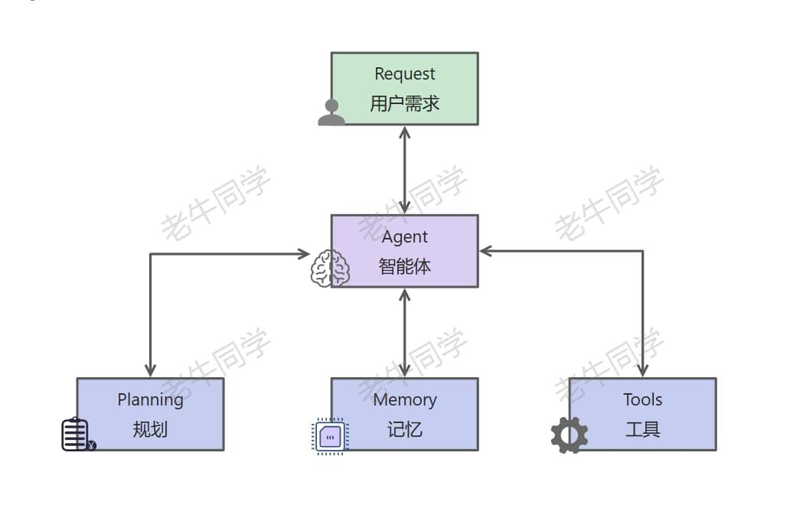
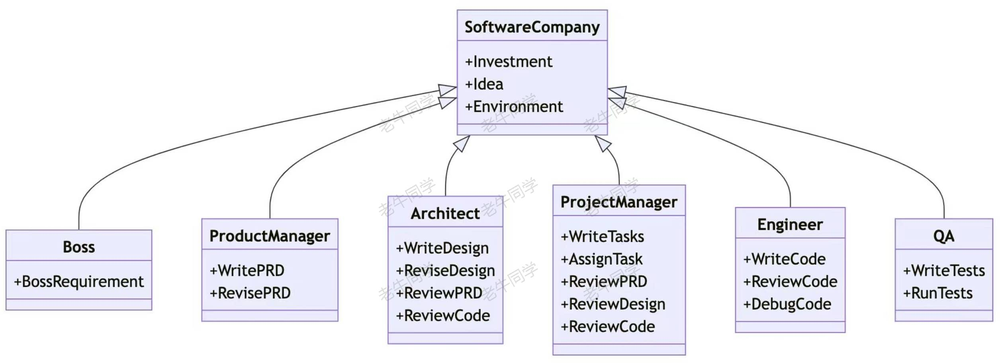
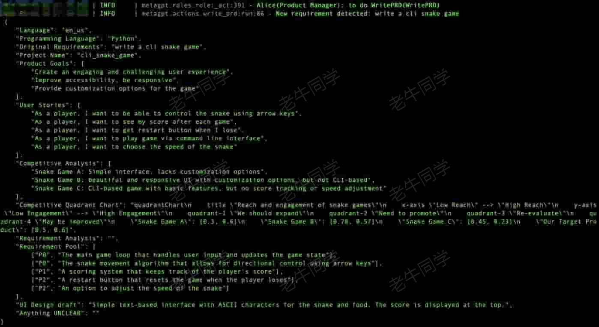
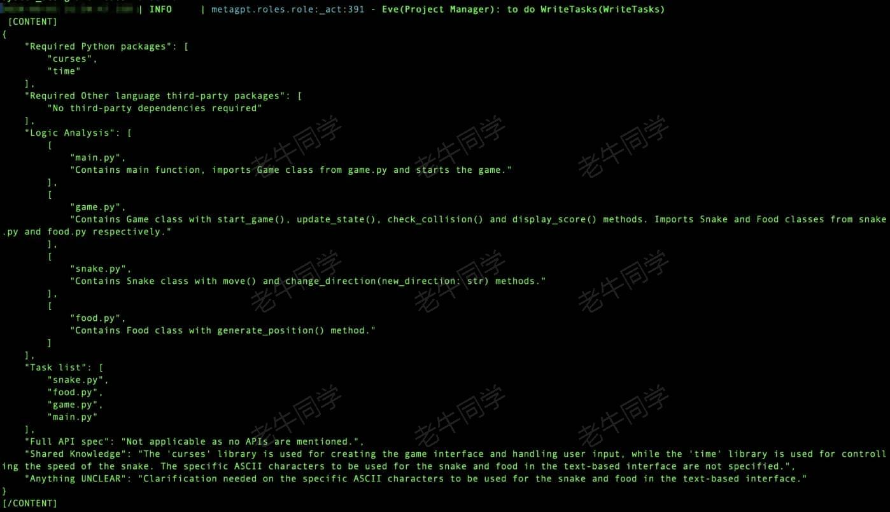
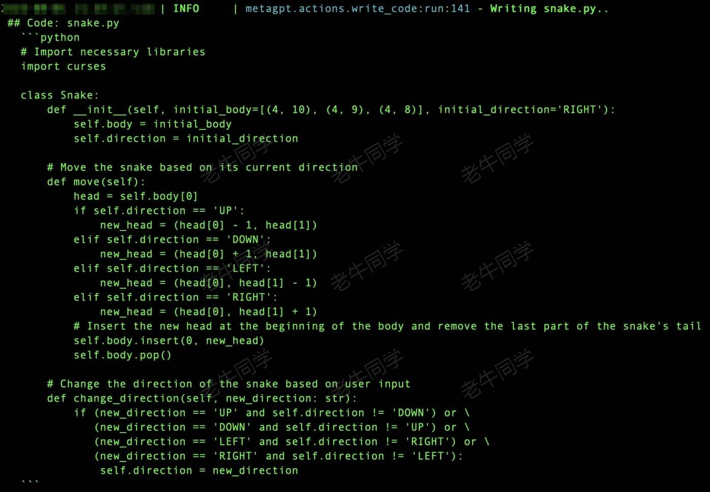

+++
slug = "2024090701"
date = "2024-09-07"
lastmod = "2024-09-07"
title = "Agent(智能体)和 MetaGPT，一句话实现整个需求应用代码"
description = "本文介绍了大模型 Agent 定义、组成部分，并以 MetaGPT 多智能体为例，一句话完成贪吃蛇小游戏需求，以介绍整个智能体的工作流程……"
image = "00.jpg"
tags = [ "AI", "Agent", "MetaGPT" ]
categories = [ "人工智能" ]
+++

前面 2 篇文章，我们使用**文生文**、**文生图**和**文生音频**三个大模型共同实现了图文并茂的**儿童绘本故事**和**绘本故事音频**需求：

1. 第一篇 根据**主题**生成儿童**绘本故事**：[GLM-4-Flash 大模型 API 免费了，手把手构建“儿童绘本”应用实战（附源码）](https://mp.weixin.qq.com/s/K3wv1K8b-k0EsPu70fmAJg)
2. 第二篇 根据儿童绘本故事生成**长音频**：[ChatTTS 长音频合成和本地部署 2 种方式，让你的“儿童绘本”发声的实战教程（文末有福利）](https://mp.weixin.qq.com/s/9ldLuh3YLvx8oWvwnrSGUA)

**友情提示**：第二篇有送书活动，活动还在继续，欢迎大家参与~

我们可以看出，儿童绘本故事的整个流程如下：


在整个流程中，其实我们核心就做了 2 件事：设定主题明确**需求**、编排整个**流程**让应用跑起来。而其他的包括构思文案、故事内容、图片生成、长音频合并等，其实都是围绕大模型不同阶段的交付物（构思和故事内容）进一步的交付物，即我们的需求**目标**。

假如我们有一个基于大模型的程序，它能准确地理解我们的需求内涵，然后进一步把需求拆分成小任务，最终组织整个任务的流程和依赖，并执行达成我们的需求目标。那么这个应用就是我们常说的大模型**Agent**（或者叫**智能体**）：大模型 Agent 是基于大语音模型（LLM）之上构建的、具备**环境感知**、**自主理解**、**决策制定**和**执行**能力的智能体。

大模型 Agent 能够模拟独立思考过程、调用各类工具，逐步达成我们的需求目标。从我们应用架构设计上讲，大模型 Agent 从原来面向过程的架构（如：儿童绘本应用）转变为面向目标的架构（提交需求后静待结果），它可以实现复杂的目标任务。

一般来说，大模型 Agent 主要由四个部分组成：**规划**、**记忆**、**工具**和**行动**，分别负责任务拆解与策略评估、信息存储与回忆、环境感知与决策辅助、和将思维转换为实际行动。



我们还是以**儿童绘本故事应用**来举例：

1. 规划（Planning）：我们通过儿童绘本故事主题，期望大模型给我们生成一本儿童绘本故事；那么大模型 Agent 需要准确识别我们的意图，然后进行任务拆分（包括：构思、故事内容、插图、音频等），制定整个处理流程。
2. 记录（Memory）：包括我们的主题、构思、故事等内容，分为短期记忆和长期记忆；短期记忆主要是上下文信息，包括多轮对话（如：绘本故事是面向多大年龄、插入风格等）；长期记忆可能包括用户特征，需要使用特征数据库存储。
3. 工具（Tools）：包括 API 调用、图片存储等，是 Agent 执行决策的辅助手段。
4. 行动（Action）：将规划、记忆转化为具体输出过程，在这个过程中可能需要使用到不同的工具与外部环境交互。

接下来，老牛同学和大家看看，一些常见的大模型 Agent 框架和应用：

# Agent 框架简单介绍

目前，开源和闭源大模型 Agent 可谓是百家争鸣、百花齐放：[https://github.com/e2b-dev/awesome-ai-agents](https://github.com/e2b-dev/awesome-ai-agents)

根据业务需求复杂度和大模型 Agent 的实现方式的差异，目前 Agent 框架可以简单分为单 Agent 和多 Agent 框架。单 Agent 框架包括如：BabyAGI 和 AutoGPT 等。

接下来，老牛同学主要介绍一个多 Agent 框架：**MetaGPT**，它是一个国内研发开源的多 Agent 框架（[https://github.com/geekan/MetaGPT](https://github.com/geekan/MetaGPT)）



**MetaGPT**以软件公司方式组成多个 Agent，实现了一个软件公司的全过程与精心调配的标准流程；它的目的是根据老板的一句话需求，完成一个软件研发整体流程（包括：用户故事、竞品分析、需求、数据结构 API 等）；内部多个 Agent 划分为多个角色（包括：产品经理、架构师、项目经理、研发工程师等），他们按照标准流程实现业务需求。

# MetaGPT 多智能体框架应用

接下来，我们来当一回**老板**：我们输入一句话需求，让**MetaGPT**实现我们的目标。

【**第一步**：**MetaGPT**环境准备】

**工欲善其事，必先利其器**，我们通过**Miniconda**管理 Python 虚拟环境，**Miniconda**的安装和使用可以参考老牛同学之前的文章：[大模型应用研发基础环境配置（Miniconda、Python、Jupyter Lab、Ollama 等）](https://mp.weixin.qq.com/s/P_ufvz4MWVSqv_VM-rJp9w)

```shell
# Python虚拟环境名：MetaGPT，版本号：3.10
conda create --name MetaGPT python=3.10 -y

# 激活虚拟环境
conda activate MetaGPT
```

【**第二步**：安装**MetaGPT**依赖】

我们可以安装**MetaGPT**的稳定版本和最新的研发版本（老牛同学使用的是**稳定版本**）：

- 稳定版本：`pip install metagpt`
- 研发版本：`pip install --upgrade git+https://github.com/geekan/MetaGPT.git`

如果我们想保留**MetaGPT**画的设计图（如：类图、序列图等），那么还需要安装 Node.js 包：`sudo npm install -g @mermaid-js/mermaid-cli`


【**第三步**：配置**MetaGPT**大模型】

前面已经介绍，大模型 Agent 是基于大模型的，因此我们需要配置一下**MetaGPT**的大语言模型。

我们可以通过命令初始化配置文件：`metagpt --init-config`

默认情况下，**MetaGPT**自动创建默认配置文件：`~/.metapgt/config2.yaml`

我们修改这个配置文件，配置我们自己的大语言模型信息（老牛同学使用的是 Ollama，其它的配置类同）：

```yaml
llm:
  api_type: "ollama"
  model: "qwen2:7b"
  base_url: "http://127.0.0.1:11434/api"
  api_key: "EMPTY"
```

有关 Ollama 详细介绍和使用，参见老牛同学之前的文章，本文不在赘述：[Ollama 完整教程：本地 LLM 管理、WebUI 对话、Python/Java 客户端 API 应用](https://mp.weixin.qq.com/s/majDONtuAUzN2SAaYWxH1Q)

【**第四步**：当**老板**，提供一句话需求，静候结果】

老牛同学之前使用大模型，一步一步通过 Prompt 提示词，完成了**消消乐**小游戏研发：[AI 已来，我与 AI 一起用 Python 编写了一个消消乐小游戏](https://mp.weixin.qq.com/s/hv2tE-yot_H04HCezxQWXg)

今天老牛同学想玩一玩**贪吃蛇**小游戏，体验一下当**老板**的乐趣，需求就一句话：**write a cli snake game**

```shell
(MetaGPT) $ metagpt "write a cli snake game"
```

接下来，我们就开始等待了，在**MetaGPT**实现需求的标准流程中，我们也可以看到它的每一步的输出：

首先，名为 Alice 的**产品经理**登场：他根据老板的需求，产出产品需求文档



有了 PRD，接下来是名为 Bob 的**架构师**来了：他根据需求文档，完成产品架构设计


接下来，名为 Eve 的**项目经理**上场：他根据架构设计，整理研发任务



有了研发任务，进行排期锁定资源，研发工程师开始研发了：



代码研发完成，就需要进行代码 Review 了：


其它研发的截图，老牛同学就省略了。经过多轮的研发任务和 CR，终于完成了整个需求，可以把代码、文件等存档：


最后，我们就可以看到最终的产出物了：

- 代码源文件目录：`./workspace/cli_snake_game/cli_snake_game`

```shell
(MetaGPT) $ tree
├── food.py
├── game.py
├── main.py
└── snake.py
```

- 项目实现文档目录：`./workspace/cli_snake_game/docs`
- 项目实现资源目录：`./workspace/cli_snake_game/resources`

我们运行一下小游戏：`python main.py`

可以看到，还真能跑起来了，可是有 Bug（如：蛇吃食物自动退出，蛇撞墙异常退出）：


至此，**MetaGPT**按照标准流程，确实帮我们完成了项目，可是我们当**老板**的并没有享受到什么乐趣，因为我们还得去改 Bug！

# 最后，(多)大模型 Agent 到底能解决什么问题？

上面**MetaGPT**帮我们写了一个有 Bug 的程序，这肯定不是我们所期望的，分析其背后原因，其实也并不是大模型 Agent 的错：

我们可以查看**MetaGPT**源代码：`https://github.com/geekan/MetaGPT/tree/main/metagpt/roles`

期核心逻辑都在`role.py`文件中：`https://github.com/geekan/MetaGPT/blob/main/metagpt/roles/role.py`

它的核心还是通过 Prompt 提示词和大模型进行交互，大模型产出质量的好坏，决定了需求结构的优劣！

那么，大模型 Agent 到底在什么场景能更有优势呢？首先能肯定的是：那些底层大模型擅长的领域！

- 复杂问题场景，大模型的初衷就是用来解决复杂问题的
- 需要多角色交互场景（如：游戏故事生成、素材生成），内容生成，部分工作提效（如：项目代码框架等）

[vLLM CPU 和 GPU 模式署和推理 Qwen2 等大语言模型详细教程](https://mp.weixin.qq.com/s/KM-Z6FtVfaySewRTmvEc6w)

[基于 Qwen2/Lllama3 等大模型，部署团队私有化 RAG 知识库系统的详细教程（Docker+AnythingLLM）](https://mp.weixin.qq.com/s/PpY3k3kReKfQdeOJyrB6aw)

[使用 Llama3/Qwen2 等开源大模型，部署团队私有化 Code Copilot 和使用教程](https://mp.weixin.qq.com/s/vt1EXVWtwm6ltZVYtB4-Tg)

[基于 Qwen2 大模型微调技术详细教程（LoRA 参数高效微调和 SwanLab 可视化监控）](https://mp.weixin.qq.com/s/eq6K8_s9uX459OeUcRPEug)

[MiniCPM-V 2.6 面壁“小钢炮”，多图、视频理解多模态模型，部署和推理实战教程](https://mp.weixin.qq.com/s/x2RKTvFeKgRvi982X5cymA)


