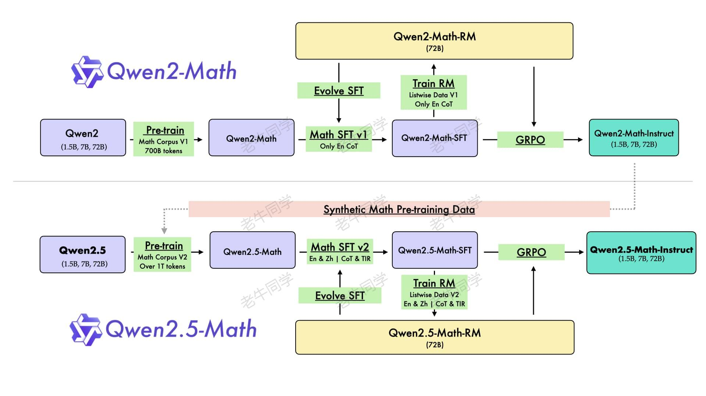
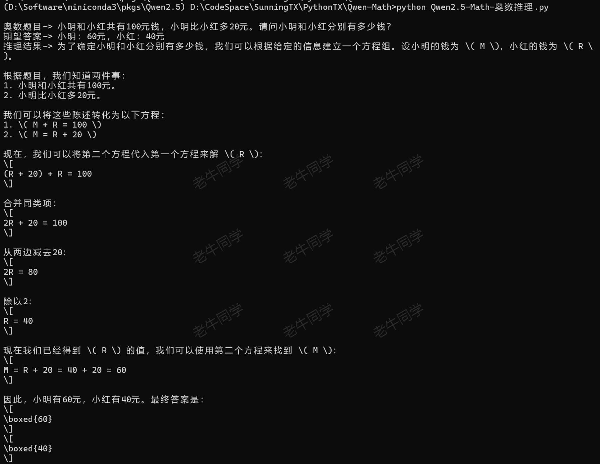
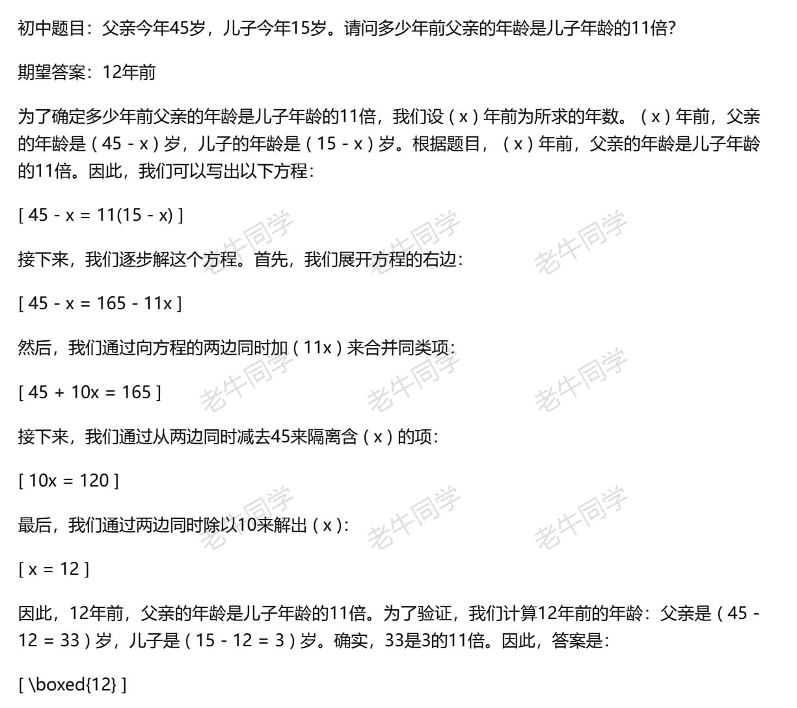

+++
slug = "2024092801"
date = "2024-09-28"
lastmod = "2024-09-28"
title = "使用世界领先的 Qwen2.5-Math 开源模型当 AI 数学老师，让奥数解题辅导不在鸡飞狗跳（文末有福利）"
description = "本文主要介绍 Qwen2.5-Math 特点和能力，并在本地进行部署和数学推理，最后验证小学和初中的奥数题目，Qwen2.5-Math 不仅解题步骤清晰明了，正确率也达到惊人的 100%……"
image = "00.jpg"
tags = [ "AI", "Qwen2.5", "奥数" ]
categories = [ "人工智能" ]
+++

在上篇文章中，我们使用**Qwen2.5-Coder**编写了一个自动编程的多智能体系统（[基于 Qwen2.5-Coder 模型和 CrewAI 多智能体框架，实现智能编程系统的实战教程](https://mp.weixin.qq.com/s/8f3xna9TRmxMDaY_cQhy8Q)），着实感受到了**Qwen2.5-Coder**和**CrewAI**强强联合所发挥出来的强大威力。

我们知道最新发布的**Qwen2.5**全家桶共有 3 个模型，除常规的大语言模型 Qwen2.5 和专门针对编程的 Qwen2.5-Coder 模型之外，还有一个专门针对数学的 **Qwen2.5-Math** 模型，它号称是**世界领先的数学开源大语言模型**，我们今天就通过奥数题目来实实在在的感受一下它的强大之处。


因此，我们将通过以下 3 个主要部分来完成 **Qwen2.5-Math** 模型的实战之旅：

1. **Qwen2.5-Math**的基本介绍，主要是简单了解一下**Qwen2.5-Math**的特点和能力
2. 本地部署**Qwen2.5-Math-1.5B**模型，通过一个一元一次方程简单数学题，体验一下其数学推理能力
3. 我们选取**小学**和**初中**阶段经典的几道奥数题，让 **Qwen2.5-Math-72B** 作为 AI 老师，来实战验证其逻辑推导能力

# Qwen2.5-Math 基本介绍、CoT 和 TIR 推理方式

**Qwen2.5-Math** 明确说明：Qwen2.5-Math 主要被设计用于通过**CoT**或**TIR**的方式解中英数学题，不推荐在其他任务上使用该系列模型。那么，什么是 **CoT** 和 **TIR** 推理方式呢？

【**CoT** 推理方式：】即思维链（Chain of Thought），主要目的是让大模型一步一步的展现出其推理过程，而不是直接给答案，就像我们人类逻辑思维过程一样，通过多步分解的方式，能更好的理解和解决复杂问题。如下数学题目的解答过程：

- 题目：小明有 10 个苹果，他给了小红 3 个苹果，然后又买了 5 个苹果，请问小明现在有几个苹果？
- **CoT** 推理过程：
  - 第一步：小明最初有 10 个苹果。
  - 第二步：小明给了小红 3 个苹果，所以现在剩下 10-3=7 个苹果。
  - 第三步：小明又买了 5 个苹果，所以现在共有 7+5=12 个苹果。
  - 答案：现在小明有 12 个苹果。

【**TIR** 推理方式：】即工具集成推理（Tool integrated Reasoning），就是在推理过程中使用外部工具（如：使用 Python 执行代码获取结果）。**TIR** 是**Qwen2.5-Math**的新特性，它能显著提升中英文的数学解题能力，包括精确计算、符号操作和算法操作等方面。具体用法可以阅读样例代码：[https://github.com/QwenLM/Qwen-Agent](https://github.com/QwenLM/Qwen-Agent)

另外，有关 **Qwen2.5-Math** 的预训练架构设计，有个特别**有趣**的地方：**Qwen2.5-Math**的部分预训练数据，竟然是由**Qwen2-Math-Instruct** 模型提供的，感觉它们已经开始在左右互搏了，因此**世界领先**也就不为奇了。



更多 **Qwen2.5-Math** 的详细介绍，可查看官网：[https://qwenlm.github.io/zh/blog/qwen2.5-math/](https://qwenlm.github.io/zh/blog/qwen2.5-math)

# **Qwen2.5-Math** 本地部署和体验

我们先本地部署 **Qwen2.5-Math** 模型，然后进行简单的数学题推理。由于老牛同学电脑配置不够强悍，因此本次演示我们使用**1.5B**参数版本（大家可根据自己硬件配置，选择不同的参数量版本）。我们通过以下三步完成整个流程：

【**第一步**：下载 **Qwen2.5-Math** 模型权重文件】

存放权重文件目录：`Qwen2.5-Math-1.5B-Instruct`

```shell
# Git大文件系统
git lfs install

# 下载模型权重文件
git clone https://www.modelscope.cn/qwen/Qwen2.5-math-1.5B-Instruct.git Qwen2.5-Math-1.5B-Instruct
```

若下载过程中异常中断，可以通过`git lfs install`命令继续下载：

```shell
# 切换到Git目录
cd Qwen2.5-Math-1.5B-Instruct

# 继续下载
git lfs install
git lfs pull
```

【**第二步**：设置 Python 虚拟环境和安装依赖】

**工欲善其事，必先利其器**，我们通过**Miniconda**管理 Python 虚拟环境，**Miniconda**的安装和使用可以参考老牛同学之前的文章：[大模型应用研发基础环境配置（Miniconda、Python、Jupyter Lab、Ollama 等）](https://mp.weixin.qq.com/s/P_ufvz4MWVSqv_VM-rJp9w)

```shell
# Python虚拟环境名：Qwen2.5，版本号：3.10
conda create -n Qwen2.5 python=3.10 -y

# 激活虚拟环境
conda activate Qwen2.5
```

接下来，在虚拟环境中下载依赖包：

```shell
pip install torch
pip install modelscope
pip install "transformers>=4.37.0"
pip install "accelerate>=0.26.0"
```

【**第三步**：使用**CoT**方式进行数学推理验证】

我们先通过一个简单数学方程：`4X+5=6X+7`，验证一下 **Qwen2.5-Math** 的推理能力：

```python
# Qwen2.5-Math-Eval-01.py

import os
from modelscope import AutoModelForCausalLM, AutoTokenizer

# 权重文件目录
model_dir = os.path.join('D:', os.path.sep, 'ModelSpace', 'Qwen2.5', 'Qwen2.5-Math-1.5B-Instruct')
print(f'权重目录: {model_dir}')

# 初始化模型
model = AutoModelForCausalLM.from_pretrained(
    model_dir,
    torch_dtype='auto',
    device_map='auto',
    local_files_only=True,
)

# 初始化分词器
tokenizer = AutoTokenizer.from_pretrained(
	model_dir,
	local_files_only=True,
)

# Prompt提示词
prompt = '请计算等式中的X值: 4X+5=6X+7'
messages = [
    {'role': 'system', 'content': '你是一位数学专家，特别擅长解答数学题。'},
    {'role': 'user', 'content': prompt}
]
text = tokenizer.apply_chat_template(
    messages,
    tokenize=False,
    add_generation_prompt=True,
)
model_inputs = tokenizer(
    [text],
    return_tensors='pt',
).to(model.device)

print(f'开始推理: {prompt}')

generated_ids = model.generate(
    **model_inputs,
    max_new_tokens=512,
)

print('推理完成.')

generated_ids = [
    output_ids[len(input_ids):] for input_ids, output_ids in zip(model_inputs.input_ids, generated_ids)
]

response = tokenizer.batch_decode(
    generated_ids,
    skip_special_tokens=True,
)[0]

print(f'推理结果: {response}')
```

执行本 Python 程序：`python Qwen2.5-Math-Eval-01.py`，可以看到 **Qwen2.5-Math** 模型通过 **CoT** 的推理方式给出了结果：


从最终结果来看，**Qwen2.5-Math** 推理过程很清晰，和我们的思维模型比较相近（唯一不足就是老牛同学电脑配置有点吃力）。

# Qwen2.5-Math-72B 推理小学和初中奥数题挑战

上面一元一次方程只是简单体验，接下来我们通过奥数题目，对 **Qwen2.5-Math** 发出挑战。因此，我们将采用 **Qwen2.5-Math-72B** 目前地表最强数学模型，来解答**小学**和**初中**奥数题目。（那为啥没有高中奥数题呢？因为老牛同学有点担心自己不会，当不了裁判，因此就不好去挑战大模型了^\_^）

我们将通过以下 3 个步骤，完成 **Qwen2.5-Math** 整个奥数题挑战验证：

【**第一步**：整理奥数题目，小学和初中分别 3 道题目】

老牛同学在网上分别找了 3 道奥数题目，我们通过 JSON 格式文件存储每道题目，每道题由等级、题目和答案组成：

```json
[
	{
		"level": "小学",
		"title": "小明和小红共有100元钱，小明比小红多20元。请问小明和小红分别有多少钱？",
		"answer": "小明：60元，小红：40元"
	}, {
		"level": "小学",
		"title": "小明围绕长方形操场跑步，跑了3圈共480米，操场的长比宽多20米。请问操场面积是多少平方米？",
		"answer": "操场面积：1500平方米"
	}, {
		"level": "小学",
		"title": "甲乙二人从两地沿直线同时相对而行，经过4小时，在距离中点4千米处相遇，甲比乙的速度快。请问甲每小时比乙快多少千米？",
		"answer": "甲每小时比乙快：2千米"
	}, {
		"level": "初中",
		"title": "小明和小红以同样多的钱买了同一种铅笔，小明要了13支，小红要了7支，小明又给小红0.6元钱。请问每支铅笔多少钱？",
		"answer": "每支铅笔：0.2元"
	}, {
		"level": "初中",
		"title": "父亲今年45岁，儿子今年15岁。请问多少年前父亲的年龄是儿子年龄的11倍？",
		"answer": "12年前"
	}, {
		"level": "初中",
		"title": "商店有一套运动服，成本价为100元，按标价的8折出售仍可获利20元。请问这套运动服的标价是多少元？",
		"answer": "这套运动服的标价：150元"
	}
]
```

【**第二步**：调用 **Qwen2.5-Math-72B** API 完成推理】

由于老牛同学本地推理比较慢，接下来将使用阿里云百炼平台 API 完成奥数推理。大家如果对自己电脑配置有信心的话，可以直接使用本地模型进行验证，可以免费完全接下来的推理。

有关阿里云百炼平台的介绍，可参考老牛同学之前的文章：[太卷了，阿里云免费 1 个月大模型算力额度，玩转 Llama3.1/Qwen2 等训练推理](https://mp.weixin.qq.com/s/xclHiuy7gFPUlWZW5oOBSg)

奥数题目的推理程序逻辑有 3 部分组成（`Qwen2.5-Math-奥数推理.py`）：

1. 读取奥数题目 JSON 文件，并循环每一道题
2. 使用 **Qwen2-Math** 模型进行推理（或者：百炼平台 API），获取结果
3. 存储奥数题目和推理结果到新文件，便于我们进行查看检测

如果大家是通过调用 API 完成推理，请先安装依赖包：`pip install OpenAI`

```python
# Qwen2.5-Math-奥数推理.py

import os
import json
from openai import OpenAI

# 初始化客户端：提前配置好`DASHSCOPE_API_KEY`环境变量
client = OpenAI(
    api_key=os.getenv('DASHSCOPE_API_KEY'),
    base_url='https://dashscope.aliyuncs.com/compatible-mode/v1',
)


# 读取奥数题目
input_file = 'Qwen2.5-Math-奥数题目.json'

with open(input_file, 'r', encoding='utf-8') as file:
    data = json.load(file)


# 循环每道题目，请求推理服务
output_data = []

for item in data:
    print('')
    print(f'奥数题目-> {item["title"]}')
    print(f'期望答案-> {item["answer"]}')

    completion = client.chat.completions.create(
        model='qwen2.5-math-72b-instruct',
        messages=[
            {'role': 'system', 'content': '你是一位数学专家，特别擅长解答数学题。'},
            {'role': 'user', 'content': item["title"]}
        ],
    )

    # 获取推理结果
    result = json.loads(completion.model_dump_json())
    content = result['choices'][0]['message']['content']

    print(f'推理结果-> {content}')

    # 暂存结果，后面统一存储到文件
    output = {
        'level': item['level'],
        'title': item['title'],
        'answer': item['answer'],
        'result': content
    }

    output_data.append(output)

    print('')


# 保存推理结果
output_file = 'Qwen2.5-Math-推理结果.md'

with open(output_file, "w", encoding="utf-8") as file:
    for output in output_data:
        file.write(f'{output["level"]}题目：{output["title"]}\n\n期望答案：{output["answer"]}\n\n')
        file.write(f'{output["result"]}\n\n---\n\n')
```

**Qwen2.5-Math-72B** 果然没有让人失望，推理过程较快，并且推理的每一步都清晰明了：



【**第三步**：验证推理结果的正确性，给出评分】

最后一步，我们打开 **Qwen2.5-Math-72B** 推理结果文件`Qwen2.5-Math-推理结果.md`，确定其准确率：**100%**（奥数题全对）



说实话，老牛同学还是挺吃惊的，它的推理速度，比老牛同学要快得多，并且推理的步骤都非常清晰明了。

对于有娃的朋友们，如果您在辅导家庭作业感到头疼的话，**Qwen2.5-Math** 赶紧使用起来吧，让我们真正体验一下父慈子孝的和谐乐趣~

# 最后：又来给大家免费包邮送几本新书

送书小活动我们举办过 1 次，送的是大模型书：[ChatTTS 长音频合成和本地部署 2 种方式，让你的“儿童绘本”发声的实战教程（文末有福利）](https://mp.weixin.qq.com/s/9ldLuh3YLvx8oWvwnrSGUA)

本期老牛同学和出版社朋友合作，继续举办送书福利小活动，送的书是《**AI 绘画基础与商业实战**》


这本新出版的书比较偏应用，通过 **Midjourney** 和 **Stable Diffusion** 等 AI 绘图大模型，协助我们在日常的餐饮、服饰等各个领域落地的应用教程，值得我们学习（正所谓**肚中有货，从容不迫**）。

那么本期福利小活动的规则如下，和上期基本类似：

1. 关注**老牛同学**微信公众号，因为这是老牛同学公众号关注者的小福利
2. 本文评论区**留言**，留言的**点赞**数排名**前 3 名**的朋友，**免费**且**包邮**获得 1 本书（即：默认送 3 本书）
3. 若本文的**阅读量**和**老牛同学** CSDN 同文的阅读量之和达到了**2000**（含**2000**），则留言的**点赞**数排名**前 6 名**的朋友均免费包邮送书（即：最多送 6 本书）
4. 活动时间：2024 年 9 月 28 日到 2024 年 10 月 5 号上午 12 点整（正好 1 周，恰逢国庆假期，便于老牛同学统计和收集寄件地址）
5. 老牛同学不参与本次活动（因为老牛同学默认就有 1 本）

最后的最后，为了方便大家购买，老牛同学贴上京东商品链接（大家也可在购书网站搜索“AI 绘画基础与商业实战”直接购买）：

【书籍购买链接】

---

往期推荐文章：

<small>[基于 Qwen2.5-Coder 模型和 CrewAI 多智能体框架，实现智能编程系统的实战教程](https://mp.weixin.qq.com/s/8f3xna9TRmxMDaY_cQhy8Q)</small>

<small>[vLLM CPU 和 GPU 模式署和推理 Qwen2 等大语言模型详细教程](https://mp.weixin.qq.com/s/KM-Z6FtVfaySewRTmvEc6w)</small>

<small>[基于 Qwen2/Lllama3 等大模型，部署团队私有化 RAG 知识库系统的详细教程（Docker+AnythingLLM）](https://mp.weixin.qq.com/s/PpY3k3kReKfQdeOJyrB6aw)</small>

<small>[使用 Llama3/Qwen2 等开源大模型，部署团队私有化 Code Copilot 和使用教程](https://mp.weixin.qq.com/s/vt1EXVWtwm6ltZVYtB4-Tg)</small>

<small>[基于 Qwen2 大模型微调技术详细教程（LoRA 参数高效微调和 SwanLab 可视化监控）](https://mp.weixin.qq.com/s/eq6K8_s9uX459OeUcRPEug)</small>

<small>[ChatTTS 长音频合成和本地部署 2 种方式，让你的“儿童绘本”发声的实战教程](https://mp.weixin.qq.com/s/9ldLuh3YLvx8oWvwnrSGUA)</small>


