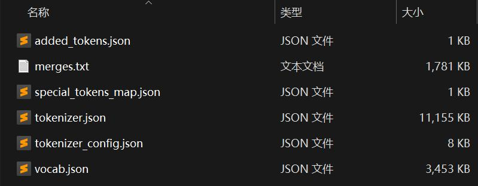
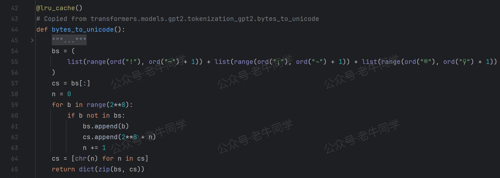
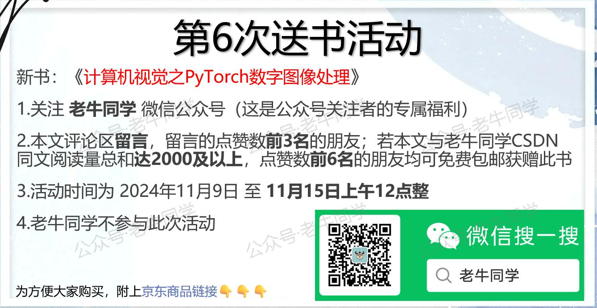

+++
slug = "2024110801"
date = "2024-11-08"
lastmod = "2024-11-08"
title = "深入解析 Transformers 框架（四）：Qwen2.5 分词流程与 BPE 分词算法技术细节"
description = "本文深入解析 Qwen2.5 大语言模型的分词流程和 BPE 分词算法。通过中英文混合文本示例，详细介绍了从文本规范化、初步分词、字节编码与映射到 BPE 分词的每一步骤。结合代码实现，揭示了 Qwen2.5 如何高效处理多语言文本，帮助读者全面理解 BPE 分词算法的原理和应用……"
image = "00.jpg"
tags = [ "AI", "Qwen2.5", "分词算法", "BPE", "transformers" ]
categories = [ "人工智能" ]
+++

前面我们已经通过三篇文章，详细介绍了 Qwen2.5 大语言模型在 Transformers 框架中的技术细节，包括包和对象加载、模型初始化和分词器技术细节：

1. [深入解析 Transformers 框架（一）：包和对象加载中的设计巧思与实用技巧](https://mp.weixin.qq.com/s/lAAIfl0YJRNrppp5-Vuusw)
2. [深入解析 Transformers 框架（二）：AutoModel 初始化及 Qwen2.5 模型加载全流程](https://mp.weixin.qq.com/s/WIbbrkf1HjVC1CtBNcU8Ow)
3. [深入解析 Transformers 框架（三）：Qwen2.5 大模型的 AutoTokenizer 技术细节](https://mp.weixin.qq.com/s/Shg30uUFByM0tKTi0rETfg)

在第 3 篇文章中，我们简要介绍了 Qwen2.5 使用的 Byte Pair Encoding (BPE) 分词算法，并用英文序列 "Hello World." 举例说明了分词过程。然而，这只是 BPE 分词的一部分内容。今天，我们将继续深入探讨 Qwen2.5 的分词流程，重点介绍 Qwen2.5 如何处理中英文混合的文本序列，并解析 BPE 分词算法的具体实现。



# 一、中英文分词示例与初步分析

为深入理解 Qwen2.5 的分词过程，我们以一段中英文混合的文本序列“Transformers分词：台风又双叒叕来了！”为例进行剖析。以下是相关的代码示例：

```python
import os

from transformers import AutoTokenizer

# 初始化分词器，从本地文件加载模型
model_dir = os.path.join('D:', os.path.sep, 'ModelSpace', 'Qwen2.5', 'Qwen2.5-1.5B-Instruct')
tokenizer = AutoTokenizer.from_pretrained(
    model_dir,
    local_files_only=True,
)

text = 'Transformers分词：台风又双叒叕来了！'
tokens = tokenizer.tokenize(text)

print(tokens)

# 输出：['Transform', 'ers', 'åĪĨ', 'è¯į', 'ï¼ļ', 'åı°é£İ', 'åıĪ', 'åıĮ', 'åı', 'Ĵ', 'åıķ', 'æĿ¥äºĨ', 'ï¼ģ']

ids = tokenizer.convert_tokens_to_ids(tokens)

print(ids)

# 输出：[8963, 388, 17177, 99689, 5122, 108118, 99518, 99493, 5758, 240, 122378, 101161, 6313]
```

我们先看看`tokenizer.convert_tokens_to_ids()`方法：它的实现比较简单，就是从词表中获取Token对应的ID；而词表其实就是一个字典，即`vocab.json`文件内容，每个 Token 都对应一个数字，即 Token ID。

如下随便挑选了上面结果几个 Token，在`vocab.json`文件中都可以找到他们的对应关系：

```plaintext
"Transform": 8963,
"åıķ": 122378,
"æĿ¥äºĨ": 101161,
```

**第 1 个问题**：为什么英文序列分词之后仍可以明确地识别出来，而中文分词之后看起来像是乱码呢？

实际上，这并非真正的乱码，而是字节 Byte 的 Unicode 字符表示。这也揭示了 BPE 算法的核心特性——基于 Byte 字节进行分词。无论是英文、中文，还是其他任何语言的字符序列，在计算机的存储与计算体系中，均以字节为基本单元进行处理。这一特性使得 BPE 算法具备了天然的通用性，能够跨越不同语言的界限，为大语言模型的多语言处理能力奠定了坚实基础。

# 二、Tokenize 分词流程详解

接下来，我们重点聚焦于`tokenizer.tokenize()`方法，深入探究其如何实现分词操作，其中 BPE 算法的具体实现过程尤为关键。通过对 Transformers 框架源代码的逐步解读，可以将其分词流程分解为以下几个关键步骤：

1. 执行`PreTrainedTokenizer.tokenize()`父类方法：在这一初始步骤中，借助 Python 内置的`unicodedata.normalize()`函数对输入的文本序列进行规范化处理。其主要目的在于消除因字符编码差异可能引发的后续处理问题，确保文本序列在字符编码层面的一致性与规范性。在当前示例中，由于输入的文本序列本身已经是规范化的文本，因此该步骤直接返回原文本序列，未进行实质性的修改操作。

2. 处理特殊 Token：特殊 Token 在分词过程中具有特殊的处理方式，它们将直接作为分词结果的一部分被返回，无需经过复杂的分词逻辑处理。

3. 执行`Qwen2Tokenizer._tokenize()`方法：这一步骤构成了分词的核心逻辑部分，其中 BPE 算法将被实际应用于文本序列的分词操作。从该方法的注释`Copied from transformers.models.gpt2.tokenization_gpt2.GPT2Tokenizer._tokenize` 可以清晰地看出，Qwen2.5 的分词逻辑实现，是复制**GPT2**的实现代码。


**第一行**代码：`re.findall(self.pat, text)` 通过正则表达式对文本序列进行初步分割：`(?i:'s|'t|'re|'ve|'m|'ll|'d)|[^\r\n\p{L}\p{N}]?\p{L}+|\p{N}| ?[^\s\p{L}\p{N}]+[\r\n]*|\s*[\r\n]+|\s+(?!\S)|\s+`，该正则表达式从基础语法层面进行初步分割，包括英文缩写词、字母数字、空白符和换行符等。

如，对于我们的输入序列`Transformers分词：台风又双叒叕来了！`，会被分割成`[Transformers分词, ：台风又双叒叕来了, ！]`三个文本片段。

**第二行**代码：`token = "".join(self.byte_encoder[b] for b in token.encode("utf-8"))` 对正则表达式分割的文本片段进行处理

- 首先，通过`token.encode("utf-8")`方法编码为 UTF-8 格式的字节序列，对于 ASCII 字符（0-127）字符，UTF-8 编码与其相同，这也是为什么分词结果，英文单词我们可以明确识别出来；而对于中文等非 ASCII 字符（128 及以上），UTF-8 会编码使用 2 到 4 个字节，如果 BPE 按照字节分词的话，一个汉字会被拆分几个部分，因此看起来就像是乱码了。如：`Transformers分词`字节序列的 16 进展表示为`Transformers\xe5\x88\x86\xe8\xaf\x8d`。

- 然后，通过`self.byte_encoder[b]`字典映射成字符，然后把每个 Byte 的字符表示拼接起来。

那么，`self.byte_encoder`字典又是如何实现的呢？



寥寥几行代码，Qwen2.5 继续复制**GPT2**的实现代码：

- 对于`!`到`~`、`¡`到`¬`和`®`到`ÿ`这些可见字符，字典键就是这些字符，值为对应的 Byte 值。

- 对于其他的非可见字符（空白和控制字符），字典键为**256+序号**，值为对应的 Byte 值。

**第 2 个问题**：为什么可见字符和非可见字符需要分开处理？其实原因也比较好理解：因为 BPE 代码无法处理的空白和控制字符，所以需要特殊处理。

因此，第 2 行代码的结果是，通过正则表达式初步分割的序列片段，把他们的每个字节按照其对应的 Unicode 字符拼接起来了，这也是为什么最终结果看起来像乱码的原因了。

**第三行**代码：`bpe_tokens.extend(bpe_token for bpe_token in self.bpe(token).split(" "))` 对于 Unicode 字符串，执行 BPE 算法，进行**分词**操作。

BPE 分词算法的核心逻辑，都在这个方法里面，下面老牛同学进行详细介绍！

# 三、BPE 分词算法核心逻辑解析

`bpe()`方法作为 BPE 分词算法的核心枢纽，其代码实现主要借鉴了 GPT2 的相关代码：


在深入探讨其核心代码之前，有必要对 BPE 算法的基本思想进行简要回顾（可参考本系列文章的第三篇：[深入解析 Transformers 框架（三）：Qwen2.5 大模型的 AutoTokenizer 技术细节](https://mp.weixin.qq.com/s/Shg30uUFByM0tKTi0rETfg)）。

首先，算法会检查缓存中是否已经存在当前 Unicode 字符串的分词结果。若缓存命中，则直接返回缓存中的分词后的 Token 列表，从而避免重复计算，提高分词效率。

若缓存未命中，则进入以下核心逻辑处理流程：

1. **第 1 行**代码：`word = tuple(token)`：将输入的 Unicode 字符串拆分为单个 Unicode 字符的元组形式。这一操作将原始字符串打散为最基本的Unicode字符单元，为后续基于字符对的合并操作奠定了基础。

2. **第 2 行**代码：`pairs = get_pairs(word)`：该方法同样源自 GPT2 的代码实现，其功能是获取给定 Unicode 字符串中所有可能的字符对组合。例如，对于“ABCD”这样的 Unicode 字符串，其返回的结果将是[(A,B),(B,C),(C,D)]，即包含了字符串中相邻两个字符组成的所有字符对。

3. **第 3 行**代码：`bigram = min(pairs, key=lambda pair: self.bpe_ranks.get(pair, float("inf")))` 对于`pairs`Unicode字符对集合中的每个元素，取`bpe_ranks`的最小值，如果不存在，则返回`float("inf")`无限大值。

那么，`self.bpe_ranks`又是什么呢？它也是一个字典，它的键是`merges.txt`文件内容去掉第 1 行版本号行后的每一行内容，值就是对应的行号。

也就是说，`bigram`的内容是`pairs`中的所有的 Unicode 字符对从`merges.txt`匹配到的最先出现的行号（即：最小值）。

**第 3 个问题**：为什么首先合并的 Unicode 字符对要取`merges.txt`文件中最小行号的字符对？

这需要我们理解`merges.txt`文件中存储的是什么内容：它存储的就是 GPT2/Qwen2.5 等大语言模型在预训练时，使用 BPE 算法进行分词时 Unicode 字符对的合并顺序。最小行号，意味着最先合并的 Unicode 字符对，也意味着出现频次最高的字符对。在我们推理时，保持同样的合并顺序，就可以保证合并结果和预训练时一致，同样保证了词表中有我们合并的Token！

BPE 算法在`while True:`循环中，持续进行字符对的合并操作：若在当前循环中成功合并了字符对，则将原有的单个 Unicode 字符对从待处理列表中移除，并将合并后的结果添加到待合并 Unicode 字符列表中。例如，对于初始字符列表：`['T','r','a','n','s','f','o','r','m','e','r','s']`，最小行号 Unicode 字符对是`('e','r')`，则在本次循环中会将“**er**”进行合并，下一轮循环时`word`的内容将更新为`['T','r','a','n','s','f','o','r','m','er','s']`。循环将持续进行，直到无法再找到可合并的字符对，或者所有字符对在`merges.txt`中均无法匹配到有效行号（即：`bigram=float("inf")`）时，循环终止，此时`word`中的内容即为最终的 Token 列表，代表了经过 BPE 算法分词后的结果。

至此，Qwen2.5 分词流程和 BPE 分词算法实现逻辑基本完成，下面进行简单总结。

# 总结：Qwen2.5 分词流程与 BPE 算法要点

**Qwen2.5 的分词流程**可以概括为以下几个关键步骤：

1. 规范化预处理：对输入的文本序列运用规范化处理手段，消除因字符编码差异可能带来的干扰因素，确保文本序列在进入分词流程前的一致性与规范性。

2. 正则表达式初步分割：借助精心设计的正则表达式，依据常见的语义和语法规则，将文本序列初步分割为多个片段序列，为后续的精细化分词操作提供基础框架。

3. BPE 算法分词：针对每个片段序列，运用 BPE 算法进行深度分词处理，将片段序列进一步分解为 Token 列表，从而完成整个文本序列的分词任务。

**BPE 分词算法**的核心要点包括：

1. 文本序列转换：将输入的文本序列通过 UTF-8 编码转换为 Byte 字节序列，再将每个字节映射为 Unicode 字符，实现文本序列在字符表示层面的转换，为基于字节的分词操作提供基础数据格式。

2. 预训练阶段字符对合并与记录：在 Qwen2.5/GPT2 等大模型的预训练阶段，对语料中的 Unicode 字符进行逐对分析与合并操作。按照字符对在语料中出现的频次高低，逐步合并出现频次最高的 Unicode 字符对，并将每次合并的字符对信息逐行记录到“merges.txt”文件中，形成预训练阶段的字符对合并顺序知识库。

3. 推理阶段字符对匹配与合并：在模型推理阶段，将每个 Unicode 字符转换为字符对形式，然后依据“merges.txt”文件中的合并顺序信息，每次仅合并最小行号（即最先合并）的字符对，持续进行合并操作直至无法再进行合并为止。最终得到的合并结果即为分词后的 Token 列表，完成对输入文本序列的分词任务，并确保推理阶段的分词结果与预训练阶段保持高度一致，从而为大语言模型在多语言文本处理中的准确性与稳定性提供有力保障。



【书籍购买链接】

---

往期推荐文章：

<small>[基于 Qwen2.5-Coder 模型和 CrewAI 多智能体框架，实现智能编程系统的实战教程](https://mp.weixin.qq.com/s/8f3xna9TRmxMDaY_cQhy8Q)</small>

<small>[vLLM CPU 和 GPU 模式署和推理 Qwen2 等大语言模型详细教程](https://mp.weixin.qq.com/s/KM-Z6FtVfaySewRTmvEc6w)</small>

<small>[基于 Qwen2/Lllama3 等大模型，部署团队私有化 RAG 知识库系统的详细教程（Docker+AnythingLLM）](https://mp.weixin.qq.com/s/PpY3k3kReKfQdeOJyrB6aw)</small>

<small>[使用 Llama3/Qwen2 等开源大模型，部署团队私有化 Code Copilot 和使用教程](https://mp.weixin.qq.com/s/vt1EXVWtwm6ltZVYtB4-Tg)</small>

<small>[基于 Qwen2 大模型微调技术详细教程（LoRA 参数高效微调和 SwanLab 可视化监控）](https://mp.weixin.qq.com/s/eq6K8_s9uX459OeUcRPEug)</small>

<small>[ChatTTS 长音频合成和本地部署 2 种方式，让你的“儿童绘本”发声的实战教程](https://mp.weixin.qq.com/s/9ldLuh3YLvx8oWvwnrSGUA)</small>

<small>[深入解析 Transformers 框架（一）：包和对象加载中的设计巧思与实用技巧](https://mp.weixin.qq.com/s/lAAIfl0YJRNrppp5-Vuusw)</small>

<small>[深入解析 Transformers 框架（二）：AutoModel 初始化及 Qwen2.5 模型加载全流程](https://mp.weixin.qq.com/s/WIbbrkf1HjVC1CtBNcU8Ow)</small>

<small>[深入解析 Transformers 框架（三）：Qwen2.5 大模型的 AutoTokenizer 技术细节](https://mp.weixin.qq.com/s/Shg30uUFByM0tKTi0rETfg)</small>


