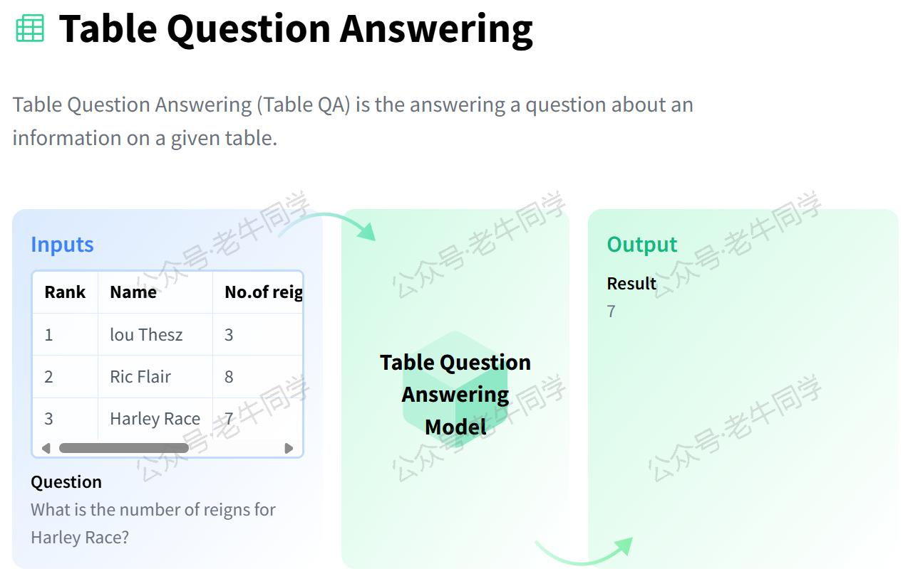
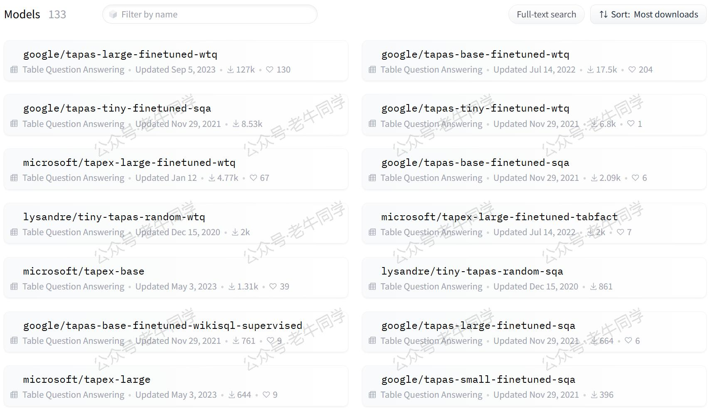
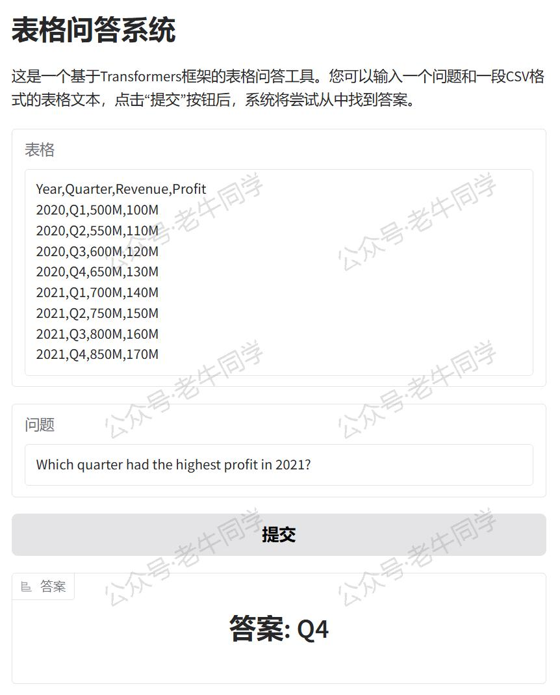
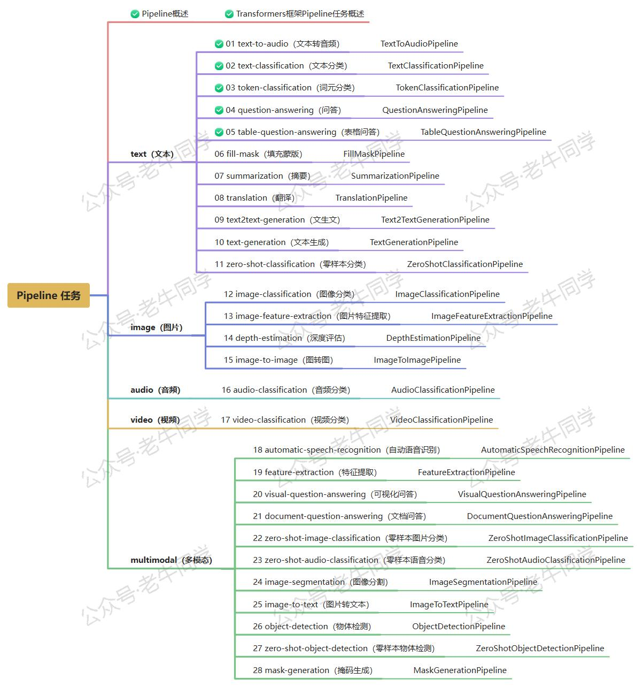

+++
slug = "2024122201"
date = "2024-12-22"
lastmod = "2024-12-22"
title = "Transformers 框架 Pipeline 任务详解（五）：表格问答（table-question-answering）"
description = "本文全面介绍了 Transformers 框架中的 table-question-answering 任务，从基础概念到实际应用，再到如何构建和部署一个交互式的表格问答系统。无论是在商业智能、教育辅导还是金融分析等领域，Transformers 框架都能为我们提供强有力的支持，助力我们快速实现高效的表格问答解决方案……"
image = "00.jpg"
tags = [ "AI", "transformers", "Pipeline", "表格问答" ]
categories = [ "人工智能" ]
+++

在自然语言处理领域，表格问答是一项能够从结构化数据中提取信息的关键技术。它结合了自然语言理解和表格数据处理的能力，使得用户可以通过自然语言提问来获取表格中的特定信息。Hugging Face 的 Transformers 框架通过其 Pipeline API 提供了强大的`table-question-answering`功能，允许开发者和研究者轻松构建高效的表格问答系统。本文将详细介绍 Transformers 框架中的`table-question-answering`任务，涵盖任务描述、应用场景、配置指南以及实战案例。



# 1. 任务简介

`table-question-answering`任务旨在根据用户提供的问题，从给定的表格数据中找出最准确的答案。例如：

- **财务分析**：询问“2023 年第四季度的净利润是多少？”，系统应当能够从财务报表中找到对应数值。
- **体育统计**：当问到“谁是 2022 年世界杯的最佳射手？”时，系统应能回答出具体球员的名字。

为了完成这一任务，通常需要以下步骤：

1. **问题解析**：理解问题的意图，并确定所需的数据字段。
2. **表格分析**：识别表格中的行、列以及可能存在的关联关系。
3. **答案生成**：基于对表格的理解，生成或抽取符合问题要求的答案。

根据 Hugging Face 官网的数据，当前已有**133**个`table-question-answering`模型，这些模型已经在大量的表格数据上进行了微调，以更好地适应特定的任务需求。



# 2. 应用场景

表格问答系统广泛应用于各个行业，以下是几个典型的应用实例：

- **商业智能**：企业可以利用表格问答工具快速查询销售数据、市场趋势等关键指标，辅助决策制定。
- **教育辅导**：教师可以使用该技术帮助学生理解复杂的数据集，如历史事件的时间线、科学实验结果等。
- **金融分析**：投资者和分析师可以借助表格问答系统分析股票行情、公司财报等信息，支持投资决策。
- **医疗健康**：研究人员和医护人员可以利用表格问答来查找临床试验结果、药物效果等医学数据。
- **政府服务**：政府部门可以通过表格问答提供公共服务信息，如人口统计数据、公共支出明细等。

# 3. 任务配置

在 Transformers 框架中，`table-question-answering`任务的配置同样直观易懂。下面是配置示例代码片段（位于`./transformers/pipelines/__init__.py`文件）：

```python
SUPPORTED_TASKS = {
    # 其他省略......

    "table-question-answering": {
        "impl": TableQuestionAnsweringPipeline,
        "pt": (AutoModelForTableQuestionAnswering,) if is_torch_available() else (),
        "tf": (TFAutoModelForTableQuestionAnswering,) if is_tf_available() else (),
        "default": {
            "model": {
                "pt": ("google/tapas-base-finetuned-wtq", "e3dde19"),
                "tf": ("google/tapas-base-finetuned-wtq", "e3dde19"),
            },
        },
        "type": "text",
    },

    # 其他省略......
}
```

默认情况下，Transformers 框架会使用`tapas-base-finetuned-wtq`作为`table-question-answering`任务的预训练模型。这个模型是在 WebTables 数据集上进行过微调的 TAPAS 版本，特别适用于英文的表格问答任务。

# 4. 表格问答实战

确保您已经安装了 Transformers 库和其他必要的依赖包：

```shell
pip install transformers torch
```

## 方法一：自动下载模型

如果您的网络环境允许，可以直接从 Hugging Face 下载模型并创建 Pipeline 任务。如下老牛同学使用 Hugging Face 镜像网站自动下载模型：

```python
import os

# 设置代理
os.environ["HF_ENDPOINT"] = "https://hf-mirror.com"

# 设置本地缓存目录
cache_dir = os.path.join('D:', os.path.sep, 'ModelSpace', 'Cache')
os.environ['HF_HOME'] = cache_dir

from transformers import pipeline

# 创建Pipeline任务
nlp = pipeline("table-question-answering", model="google/tapas-base-finetuned-wtq")

# 执行表格问答任务
if __name__ == "__main__":
    # 表格数据
    table = [
        {"Year": "2020", "Quarter": "Q1", "Revenue": "500M", "Profit": "100M"},
        {"Year": "2020", "Quarter": "Q2", "Revenue": "550M", "Profit": "110M"},
        {"Year": "2020", "Quarter": "Q3", "Revenue": "600M", "Profit": "120M"},
        {"Year": "2020", "Quarter": "Q4", "Revenue": "650M", "Profit": "130M"},
        # 更多行...
    ]

    # 执行任务
    result = nlp(table=table, query="What was the profit in Q4 of 2020?")

    print(result)
    # 输出：{'answer': '130M', 'coordinates': [(3, 3)], 'cells': ['130M'], 'aggregator': 'NONE'}
```

输出结果如下：

```plaintext
{'answer': '130M', 'coordinates': [(3, 3)], 'cells': ['130M'], 'aggregator': 'NONE'}
```

输出结果直接给出了模型认为的答案文本，在这个例子中，答案是“**130M**”。

对于输出结果对象的元素，详细说明如下：

1. `answer`：模型给出的答案文本，在这个例子中是“130M”，表示 2020 年第四季度的利润。
2. `coordinates`：是一个列表，其中每个元素是一个元组，代表了表格中与答案相关的单元格的位置。元组的第一个值是行索引，第二个值是列索引，都是从 0 开始计数。在这个例子中，`(3, 3)`意味着答案位于表格的第 4 行（因为索引从 0 开始，所以 3 代表的是第四行）和第 4 列。
3. `cells`：列出所有参与构建答案的单元格内容。在这个例子中，只有单个单元格的内容“130M”被用作答案，因此列表中只有一个元素。
4. `aggregator`：指明了是否以及如何对多个单元格或数值进行了聚合操作以生成答案。可能的值包括但不限于`"NONE"`、`"SUM"`、`"AVERAGE"`、`"COUNT"`等。在这个例子中，`"NONE"`表示没有执行任何聚合操作，答案直接来自单个单元格的内容。

## 方法二：自主下载模型

如果您希望使用本地模型文件，可以按照以下步骤操作：

```python
from transformers import AutoTokenizer, AutoModelForTableQuestionAnswering, pipeline
import os

# 下载模型目录
model_dir = '/models/table_question_answering'

# 加载分词器和模型
tokenizer = AutoTokenizer.from_pretrained(model_dir, local_files_only=True)
model = AutoModelForTableQuestionAnswering.from_pretrained(model_dir, torch_dtype="auto", device_map="auto", local_files_only=True)

# 创建Pipeline任务
nlp = pipeline("table-question-answering", tokenizer=tokenizer, model=model)

# 后续用法与自动下载相同
```

# 5. WebUI 界面

为了使`table-question-answering` Pipeline 任务更易于使用或演示，我们可以使用 Gradio 创建一个直观的 WebUI 界面。以下是创建界面的代码示例：

```python
import sys

# 直接复用Pipeline实例
sys.path.append("./")
pipeline = __import__("05-table-question-answering")

import gradio as gr


# 定义表格问答函数
def answer_table_question(query, table):
    # 将字符串形式的表格转换为列表字典
    table_list = [dict(zip(table.split('\n')[0].split(','), row.split(','))) for row in table.split('\n')[1:]]
    result = pipeline.nlp(query=query, table=table_list)
    return f"答案: {result['answer']}"

# 创建Gradio界面
with gr.Blocks() as demo:
    gr.Markdown("# 表格问答系统")
    gr.Markdown(
        "这是一个基于Transformers框架的表格问答工具。您可以输入一个问题和一段CSV格式的表格文本，点击“提交”按钮后，系统将尝试从中找到答案。")

    with gr.Row():
        input_table = gr.Textbox(placeholder="请输入表格数据（CSV格式）...", label="表格")

    with gr.Row():
        input_query = gr.Textbox(placeholder="请输入您的问题...", label="问题")

    with gr.Row():
        submit_button = gr.Button("提交")

    with gr.Row():
        output_answer = gr.Label(label="答案")

    # 设置按钮点击事件，触发表格问答函数
    submit_button.click(answer_table_question, inputs=[input_query, input_table], outputs=output_answer)

# 启动Gradio应用
if __name__ == "__main__":
    demo.launch()
```

运行上述代码，我们可以看到 URL 信息：

```shell
* Running on local URL:  http://127.0.0.1:7860

To create a public link, set `share=True` in `launch()`.
```

通过浏览器打开地址，就可以通过可视化的方式进行表格问答了。



我们可以用如下表格样例数据来测试 Table QA：

```csv
Year,Quarter,Revenue,Profit
2020,Q1,500M,100M
2020,Q2,550M,110M
2020,Q3,600M,120M
2020,Q4,650M,130M
2021,Q1,700M,140M
2021,Q2,750M,150M
2021,Q3,800M,160M
2021,Q4,850M,170M
```

问题：`Which quarter had the highest profit in 2021?`

预期答案：`Q4` (因为 2021 年第四季度的利润最高，为 170M)

如果想要分享给更多人，可以在 `launch()` 函数中设置 `share=True` 参数，Gradio 将生成一个公开链接供他人访问。

# 6. 总结

本文全面介绍了 Transformers 框架中的`table-question-answering`任务，从基础概念到实际应用，再到如何构建和部署一个交互式的表格问答系统。无论是在商业智能、教育辅导还是金融分析等领域，Transformers 框架都能为我们提供强有力的支持，助力我们快速实现高效的表格问答解决方案。

老牛同学将持续为大家带来更多有关 Pipeline 任务的文章（共**28**篇）。如果您有任何疑问或建议，请随时在评论区留言交流！



---

Transformers 框架：

<small>[01.包和对象加载中的设计巧思与实用技巧](https://mp.weixin.qq.com/s/lAAIfl0YJRNrppp5-Vuusw)</small>

<small>[02.AutoModel 初始化及 Qwen2.5 模型加载全流程](https://mp.weixin.qq.com/s/WIbbrkf1HjVC1CtBNcU8Ow)</small>

<small>[03.Qwen2.5 大模型的 AutoTokenizer 技术细节](https://mp.weixin.qq.com/s/Shg30uUFByM0tKTi0rETfg)</small>

<small>[04.Qwen2.5/GPT 分词流程与 BPE 分词算法技术细节](https://mp.weixin.qq.com/s/GnoHXsIYKYFU1Xo4u5sE1w)</small>

<small>[05.嵌入（Embedding）机制和 Word2Vec 实战](https://mp.weixin.qq.com/s/qL9vpmNIM1eO9_lQq7QwlA)</small>

Pipeline NLP 任务：

<small>[零·概述](https://mp.weixin.qq.com/s/FR4384AZV2FE2xtweSh9bA) 丨 [01.文本转音频](https://mp.weixin.qq.com/s/uN2BFIOxDFEh4T-W7tsPbg) 丨 [02.文本分类](https://mp.weixin.qq.com/s/9ccEDNfeGNf_Q9pO0Usg2w) 丨 [03.词元分类和命名实体识别](https://mp.weixin.qq.com/s/r2uFCwPZaMeDL_eiQsEmIQ) 丨 [04.问答](https://mp.weixin.qq.com/s/vOLVxRircw5wM1_rCqoAfg)</small>

往期推荐文章：

<small>[Bolt.new 用一句话快速构建全栈应用：本地部署与应用实战（Ollama/Qwen2.5 等）](https://mp.weixin.qq.com/s/Mq8CvZKdpokbj3mK-h_SAQ)</small>

<small>[基于 Qwen2.5-Coder 模型和 CrewAI 多智能体框架，实现智能编程系统的实战教程](https://mp.weixin.qq.com/s/8f3xna9TRmxMDaY_cQhy8Q)</small>

<small>[vLLM CPU 和 GPU 模式署和推理 Qwen2 等大语言模型详细教程](https://mp.weixin.qq.com/s/KM-Z6FtVfaySewRTmvEc6w)</small>

<small>[基于 Qwen2/Lllama3 等大模型，部署团队私有化 RAG 知识库系统的详细教程（Docker+AnythingLLM）](https://mp.weixin.qq.com/s/PpY3k3kReKfQdeOJyrB6aw)</small>

<small>[使用 Llama3/Qwen2 等开源大模型，部署团队私有化 Code Copilot 和使用教程](https://mp.weixin.qq.com/s/vt1EXVWtwm6ltZVYtB4-Tg)</small>

<small>[基于 Qwen2 大模型微调技术详细教程（LoRA 参数高效微调和 SwanLab 可视化监控）](https://mp.weixin.qq.com/s/eq6K8_s9uX459OeUcRPEug)</small>

<small>[ChatTTS 长音频合成和本地部署 2 种方式，让你的“儿童绘本”发声的实战教程](https://mp.weixin.qq.com/s/9ldLuh3YLvx8oWvwnrSGUA)</small>


